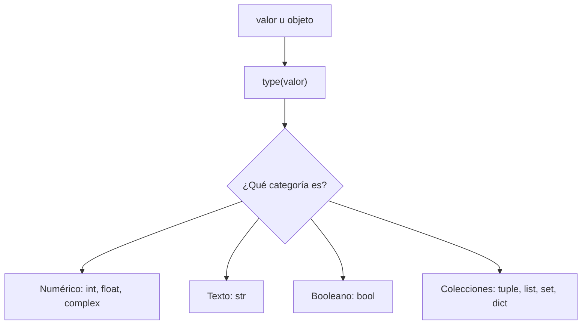

# Laboratorio 1.1 – Explorando tipos de datos

## Objetivo de la práctica:
Al finalizar la práctica, serás capaz de:
- Utilizar la función preconstruida `type()` para identificar el tipo de dato de cualquier valor u objeto en Python.
- Diferenciar entre tipos de datos numéricos, de texto, booleanos y de colección.
- Reconocer que las comillas simples y dobles producen el mismo tipo de dato (`str`) en Python.

## Objetivo Visual
El siguiente diagrama resume las categorías de tipos de datos que exploraremos en esta práctica y cómo `type()` nos permite identificarlos:



## Duración aproximada:
- 7 minutos.

## Tabla de ayuda:
| Herramienta | Versión / Detalle | Notas |
| --- | --- | --- |
| Python | 3.10 o superior | Verifica tu versión con `python --version` en la terminal |
| Consola | Python REPL (intérprete interactivo) | Se abre escribiendo `python` (o `python3`) en la terminal |
| Documentación | docs.python.org/3/library/stdtypes.html | Referencia oficial de los tipos de datos incorporados |

## Instrucciones

### Tarea 1. Preparar el entorno de trabajo
Paso 1. Abrir una terminal (símbolo del sistema, PowerShell o terminal integrada de VSC).

Paso 2. Iniciar el intérprete interactivo de Python ejecutando el comando `python` (en algunos sistemas puede ser `python3`).

```bash
python
```

> **¿Qué hace este comando?** Abre el REPL (*Read-Eval-Print Loop*) de Python: un entorno interactivo donde cada línea que escribes se ejecuta de inmediato y su resultado se muestra en pantalla.
>
> **¿Por qué se usa este enfoque?** El REPL es ideal para exploración rápida de conceptos —como los tipos de datos— porque no requiere crear ni guardar un archivo; ves el resultado al instante.
>
> **Resultado esperado:** el símbolo del sistema cambia a `>>>`, indicando que el intérprete está listo para recibir instrucciones.

### Tarea 2. Explorar tipos numéricos y booleanos
Paso 1. Insertar `type(3)` y presionar `[Enter]`.

```python
>>> type(3)
```

> **Explicación:** `type()` es una función preconstruida (built-in) que recibe cualquier valor y devuelve su clase. Aquí `3` es un número entero, así que Python reporta su clase `int`.
>
> **Resultado esperado:**
> ```
> <class 'int'>
> ```

Paso 2. Insertar `type(3.1)` y presionar `[Enter]`.

> **Resultado esperado:** `<class 'float'>`, porque cualquier número con punto decimal se representa internamente como `float` (número de punto flotante).

Paso 3. Insertar `type(1==1)` y presionar `[Enter]`.

> **Explicación:** `1==1` es una expresión de comparación que se evalúa antes de pasarse a `type()`; su resultado es un valor booleano (`True`).
>
> **Resultado esperado:** `<class 'bool'>`.
>
> 💡 **Buena práctica:** recuerda que en Python `bool` es en realidad una subclase de `int` (`True` equivale a `1` y `False` a `0`), lo cual explica por qué expresiones como `True + True` son válidas y devuelven `2`.

### Tarea 3. Explorar tipos de texto
Paso 1. Insertar `type("3")` y presionar `[Enter]`.

Paso 2. Insertar `type('3')` y presionar `[Enter]`.

> **Explicación:** ambas instrucciones devuelven `<class 'str'>`. A diferencia de otros lenguajes, Python no distingue entre comillas simples y dobles: ambas delimitan cadenas de texto (`str`). La elección entre una u otra normalmente depende de si el texto contiene comillas internas que quieras evitar escapar.

Paso 3. Insertar `type("pizza")` y presionar `[Enter]`.

> **Resultado esperado:** `<class 'str'>`, ya que cualquier secuencia de caracteres entre comillas es una cadena, sin importar su contenido.

### Tarea 4. Explorar tipos de colección
Paso 1. Insertar `type(('1','2','3'))` y presionar `[Enter]`.

> **Explicación:** los paréntesis `()` con elementos separados por comas crean una **tupla**: una colección ordenada e **inmutable** (no se puede modificar después de creada).
>
> **Resultado esperado:** `<class 'tuple'>`.

Paso 2. Insertar `type(["1","2","3"])` y presionar `[Enter]`.

> **Explicación:** los corchetes `[]` crean una **lista**: una colección ordenada y **mutable**.
>
> **Resultado esperado:** `<class 'list'>`.

Paso 3. Insertar `type({"1","2","3"})` y presionar `[Enter]`.

> **Explicación:** las llaves `{}` con elementos sueltos (sin pares clave-valor) crean un **conjunto (set)**: una colección **no ordenada** que no permite elementos duplicados.
>
> **Resultado esperado:** `<class 'set'>`.

Paso 4. Insertar `type({"1":"Hola","2":"Adios","3":"Buen día"})` y presionar `[Enter]`.

> **Explicación:** las llaves `{}` con pares `clave: valor` crean un **diccionario (dict)**: una colección que asocia claves únicas con valores.
>
> **Resultado esperado:** `<class 'dict'>`.
>
> 💡 **Buena práctica:** fíjate en cómo el mismo símbolo `{}` produce dos tipos distintos (`set` o `dict`) dependiendo de si escribes pares `clave: valor` o solo valores. Es una fuente común de errores para quienes comienzan con Python.

### Tarea 5. Reflexionar sobre otros tipos de datos
Paso 1. A partir de lo explorado, identifica al menos un tipo de dato de Python que **no** haya aparecido en la lista anterior (por ejemplo: `complex`, `bytes`, `frozenset` o `NoneType`).

Paso 2. Verifica tu respuesta ejecutando `type()` sobre un valor de ese tipo, por ejemplo:

```python
>>> type(3+4j)
>>> type(None)
```

Paso 3. Comparte tu hallazgo con el grupo y comenta en qué situación podrías usar ese tipo de dato.

### Resultado esperado
Al finalizar, tu consola debe mostrar una secuencia similar a la siguiente:

```
>>> type(3)
<class 'int'>
>>> type(3.1)
<class 'float'>
>>> type("3")
<class 'str'>
>>> type('3')
<class 'str'>
>>> type("pizza")
<class 'str'>
>>> type(1==1)
<class 'bool'>
>>> type(('1','2','3'))
<class 'tuple'>
>>> type(["1","2","3"])
<class 'list'>
>>> type({"1","2","3"})
<class 'set'>
>>> type({"1":"Hola","2":"Adios","3":"Buen día"})
<class 'dict'>
```
