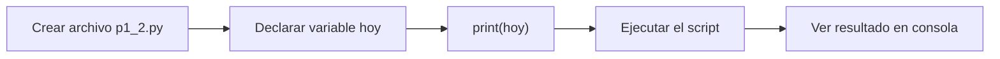

# Laboratorio 1.2 – Un script básico

## Objetivo de la práctica:
Al finalizar la práctica, serás capaz de:
- Crear un script de Python desde cero utilizando un editor de código.
- Declarar una variable de tipo texto y desplegar su valor con `print()`.
- Ejecutar un script `.py` de distintas formas (terminal y editor).

## Objetivo Visual


## Duración aproximada:
- 5 minutos.

## Tabla de ayuda:
| Herramienta | Versión / Detalle | Notas |
| --- | --- | --- |
| Visual Studio Code | Última versión estable | Editor recomendado para el curso |
| Python | 3.10 o superior | Debe estar en el PATH del sistema |
| Carpeta de trabajo | `ws_curso` | Carpeta dedicada para todas las prácticas del curso |
| Nombre de archivo | `p1_2.py` | Nombre exacto solicitado en esta práctica |

## Instrucciones

### Tarea 1. Preparar la carpeta y el archivo de trabajo
Paso 1. Crear (si aún no existe) una carpeta de nombre `ws_curso` dedicada a las prácticas del curso.

Paso 2. Abrir Visual Studio Code (VSC) y, dentro de él, abrir la carpeta `ws_curso` (`Archivo > Abrir carpeta...`).

Paso 3. Crear un nuevo archivo dentro de esa carpeta con el nombre exacto `p1_2.py`.

> **¿Por qué usar una carpeta dedicada?** Mantener todas las prácticas en `ws_curso` evita conflictos de nombres entre archivos de distintos capítulos y facilita que los módulos que crearás más adelante en el curso puedan importarse entre sí sin problemas de rutas.

### Tarea 2. Declarar la variable y desplegar su valor
Paso 1. Dentro de `p1_2.py`, declarar una variable llamada `hoy` que contenga, como cadena de texto, el día actual de la semana.

```python
hoy = "Lunes"
```

> **¿Qué hace este código?** Crea una variable llamada `hoy` y le asigna un literal de tipo `str` (cadena de texto). En Python no es necesario declarar el tipo de la variable de antemano: el tipo se infiere del valor asignado (tipado dinámico).
>
> **¿Por qué se usan comillas dobles?** El enunciado pide explícitamente usar comillas dobles, pero recuerda —de la práctica anterior— que el resultado sería idéntico con comillas simples. Aquí usaremos comillas dobles por convención de legibilidad cuando el texto no contiene comillas internas.

Paso 2. Utilizar la función `print()` para desplegar a la salida estándar el valor de la variable.

```python
print(hoy)
```

> **¿Qué hace este código?** `print()` envía el valor recibido como argumento a la salida estándar (normalmente la terminal). En este caso, imprime el contenido de la variable `hoy`.
>
> **Resultado esperado al ejecutar ambas líneas juntas:**
> ```
> Lunes
> ```

### Tarea 3. Ejecutar el script
Paso 1. Guardar el archivo (`Ctrl+S` / `Cmd+S`).

Paso 2. Abrir una terminal integrada en VSC (`Terminal > Nueva terminal`) y ejecutar:

```bash
python p1_2.py
```

> **Resultado esperado:** la terminal debe mostrar únicamente el texto `Lunes` (o el día que hayas indicado).

Paso 3. Como forma alternativa de ejecución, usar el botón ▶ ("Run Python File") ubicado en la esquina superior derecha del editor de VSC, o presionar `F5` si tienes configurado el depurador de Python.

> 💡 **Buena práctica:** ejecutar el script desde la terminal integrada te permite ver también los mensajes de error completos (tracebacks) cuando algo falla, mientras que el botón ▶ es más rápido para iteraciones cortas durante el aprendizaje.

### Resultado esperado
Al ejecutar `p1_2.py` desde la terminal, deberías obtener una salida similar a:

```
$ python p1_2.py
Lunes
```

Si en vez del día de la semana ves un error como `NameError` o `IndentationError`, revisa que la variable `hoy` esté escrita exactamente igual en ambas líneas y que no existan espacios al inicio de las líneas (Python es sensible a la indentación incluso fuera de bloques).
