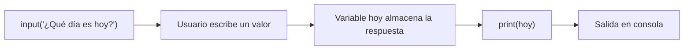

# Laboratorio 1.3 – Interactuando con el usuario

## Objetivo de la práctica:
Al finalizar la práctica, serás capaz de:
- Solicitar información al usuario desde la línea de comandos usando `input()`.
- Almacenar la respuesta del usuario en una variable y desplegarla con `print()`.
- Observar el comportamiento del programa ante distintos tipos de entrada (vacía, numérica, textual).

## Objetivo Visual


## Duración aproximada:
- 7 minutos.

## Tabla de ayuda:
| Herramienta | Versión / Detalle | Notas |
| --- | --- | --- |
| Visual Studio Code | Última versión estable | |
| Python | 3.10 o superior | |
| Carpeta de trabajo | `ws_curso` | Misma carpeta usada en la práctica 1.2 |
| Nombre de archivo | `p1_3.py` | |

## Instrucciones

### Tarea 1. Crear el archivo de la práctica
Paso 1. En VSC, dentro de la carpeta `ws_curso`, crear un nuevo archivo de nombre `p1_3.py`.

### Tarea 2. Solicitar información al usuario y desplegarla
Paso 1. Solicitar al usuario que ingrese el día de la semana y almacenar el resultado en una variable de nombre `hoy`.

```python
hoy = input("¿Qué día de la semana es hoy? ")
```

> **¿Qué hace este código?** La función preconstruida `input()` pausa la ejecución del programa, muestra el texto que se le pasa como argumento (el *prompt*) y espera a que el usuario escriba algo y presione `[Enter]`. Lo que el usuario escribe se devuelve **siempre como una cadena de texto (`str`)**, sin importar lo que haya tecleado.
>
> **¿Por qué es importante saber esto?** Es una de las causas más comunes de errores para quienes inician en Python: si necesitas tratar la entrada como número, debes convertirla explícitamente (por ejemplo con `int()` o `float()`); `input()` nunca lo hace por ti.

Paso 2. Utilizar la función `print()` para desplegar a la salida estándar el valor de la variable `hoy`.

```python
print("Hoy es:", hoy)
```

> **Resultado esperado (si el usuario escribe "Martes"):**
> ```
> ¿Qué día de la semana es hoy? Martes
> Hoy es: Martes
> ```

### Tarea 3. Probar el script con distintos valores
Paso 1. Guardar y ejecutar el script varias veces desde la terminal (`python p1_3.py`), ingresando cada vez un valor diferente: una palabra normal, un texto vacío (presionar `[Enter]` sin escribir nada) y un número.

Paso 2. Observar y anotar el comportamiento del programa en cada caso.

> **Explicación del resultado:** en los tres casos el programa se ejecuta **sin error**, porque `hoy` sigue siendo un `str` sin importar lo que el usuario haya ingresado — incluso una cadena vacía `""` o algo como `"123"` son válidos como texto. Esto contrasta con lo que ocurriría si intentáramos usar directamente `int(input(...))` con una entrada no numérica, lo que sí generaría un `ValueError` (concepto que profundizarás en la práctica 1.5).

### Resultado esperado
Ejemplo de tres ejecuciones distintas:

```
$ python p1_3.py
¿Qué día de la semana es hoy? Miércoles
Hoy es: Miércoles

$ python p1_3.py
¿Qué día de la semana es hoy? 
Hoy es: 

$ python p1_3.py
¿Qué día de la semana es hoy? 7
Hoy es: 7
```

> 💡 **Buena práctica:** cuando el valor de `input()` deba interpretarse como número, valida o convierte explícitamente su contenido antes de usarlo en operaciones aritméticas, para evitar errores en tiempo de ejecución.
