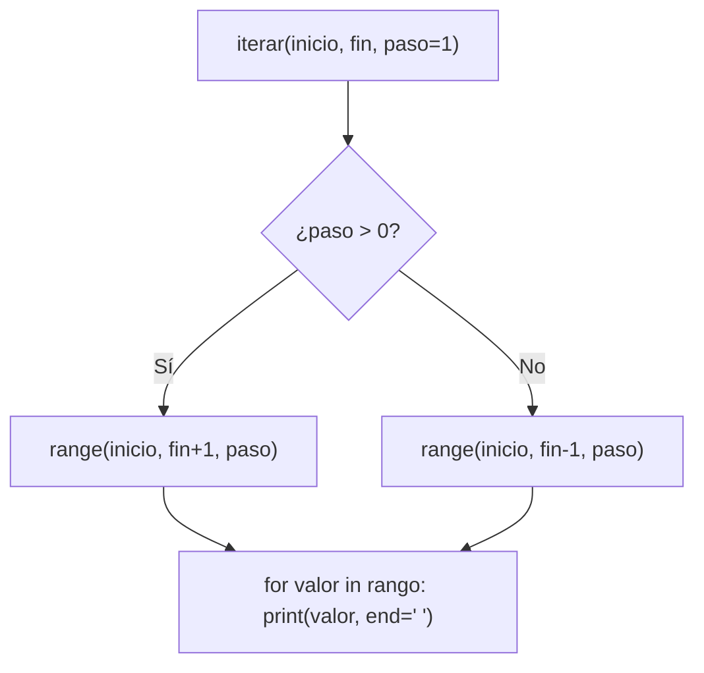

# Laboratorio 1.4 – Iterando

## Objetivo de la práctica:
Al finalizar la práctica, serás capaz de:
- Iterar utilizando la función preconstruida `range()`.
- Construir una función propia con un parámetro por defecto.
- Controlar el formato de salida de un ciclo `for` usando el argumento `end` de `print()`.

## Objetivo Visual


## Duración aproximada:
- 10 minutos.

## Tabla de ayuda:
| Herramienta | Versión / Detalle | Notas |
| --- | --- | --- |
| Visual Studio Code | Última versión estable | |
| Python | 3.10 o superior | |
| Carpeta de trabajo | `ws_curso` | |
| Nombre de archivo | `p1_4.py` | |

## Instrucciones

### Tarea 1. Crear el archivo de la práctica
Paso 1. En la carpeta `ws_curso`, crear un nuevo archivo de nombre `p1_4.py`.

### Tarea 2. Definir la función de iteración
Paso 1. Definir una función llamada `iterar` que reciba tres parámetros: `inicio`, `fin` y `paso`, donde `paso` tenga un valor por defecto de `1`.

```python
def iterar(inicio, fin, paso=1):
    pass  # el cuerpo se completa en los pasos siguientes
```

> **¿Qué hace este código?** Define una función con un **parámetro por defecto** (`paso=1`). Esto significa que si quien invoca la función no proporciona un tercer argumento, Python usará automáticamente el valor `1`.
>
> 💡 **Buena práctica:** en el curso oficial esta función se llama `iter()`, igual que la función preconstruida de Python que crea iteradores. Aquí la llamaremos `iterar()` para **evitar sombrear (shadow)** el nombre `iter`: sobrescribir nombres de funciones incorporadas puede causar errores confusos más adelante en el mismo archivo si necesitas usar el `iter()` original.

Paso 2. Dentro de la función, calcular el rango a recorrer usando `range()`, contemplando que el valor `fin` debe **incluirse** en la iteración y que `paso` puede ser positivo o negativo.

```python
def iterar(inicio, fin, paso=1):
    if paso > 0:
        rango = range(inicio, fin + 1, paso)
    else:
        rango = range(inicio, fin - 1, paso)
```

> **¿Qué hace este código?** `range(inicio, fin, paso)` genera una secuencia de números **sin incluir** el límite superior. Para que la función sí incluya el valor `fin` (como pide el ejercicio), sumamos o restamos `1` al límite según la dirección del paso: `+1` cuando avanzamos (paso positivo) y `-1` cuando retrocedemos (paso negativo).
>
> **¿Por qué se usa un condicional aquí?** Porque `range()` con un paso positivo y un límite superior menor al inicio (o viceversa) simplemente genera una secuencia vacía; el condicional asegura que el ajuste del límite sea el correcto en ambos sentidos.

Paso 3. Completar la función para que despliegue la iteración completa **en una sola línea**, usando el argumento `end` de `print()`.

```python
def iterar(inicio, fin, paso=1):
    if paso > 0:
        rango = range(inicio, fin + 1, paso)
    else:
        rango = range(inicio, fin - 1, paso)
    for valor in rango:
        print(valor, end=' ')
    print()  # salto de línea final
```

> **¿Qué hace `end=' '`?** Por defecto, `print()` añade un salto de línea (`\n`) al final de cada llamada. Al indicar `end=' '` (un espacio), le decimos que en su lugar añada un espacio, de modo que todos los valores impresos en el ciclo queden en la misma línea.
>
> **¿Por qué el `print()` final sin argumentos?** Sirve únicamente para cerrar la línea con un salto de línea al terminar el ciclo, dejando la consola lista para la siguiente salida.

### Tarea 3. Invocar la función con valores ascendentes
Paso 1. Invocar la función con los siguientes valores y observar la salida de cada una:

```python
iterar(1, 10)
iterar(1, 10, 2)
iterar(1, 10, 5)
```

> **Resultado esperado:**
> ```
> 1 2 3 4 5 6 7 8 9 10
> 1 3 5 7 9
> 1 6
> ```
> **Explicación:** con `paso=2`, `range(1, 11, 2)` genera `1, 3, 5, 7, 9` (se detiene antes de superar 10). Con `paso=5`, `range(1, 11, 5)` genera `1, 6` (el siguiente valor, 11, ya está fuera del rango).

### Tarea 4. Invocar la función con resultados descendentes y negativos
Paso 1. Invocar la función de tal manera que la línea del resultado sea `5 4 3 2 1 0`.

```python
iterar(5, 0, -1)
```

> **Explicación:** al usar un `paso` negativo, la rama `else` de nuestro condicional entra en acción: `range(5, -1, -1)` recorre de `5` a `0` en reversa, incluyendo el `0` gracias al ajuste `fin - 1`.

Paso 2. Invocar la función de tal manera que la línea del resultado sea `-3 -2 -1 0 1 2 3`.

```python
iterar(-3, 3)
```

> **Explicación:** al no indicar el tercer argumento, `paso` toma su valor por defecto (`1`), por lo que la función recorre de `-3` a `3` incluyendo ambos extremos.

### Resultado esperado
La salida completa en consola, al ejecutar las cinco invocaciones anteriores en orden, debe verse así:

```
1 2 3 4 5 6 7 8 9 10
1 3 5 7 9
1 6
5 4 3 2 1 0
-3 -2 -1 0 1 2 3
```
