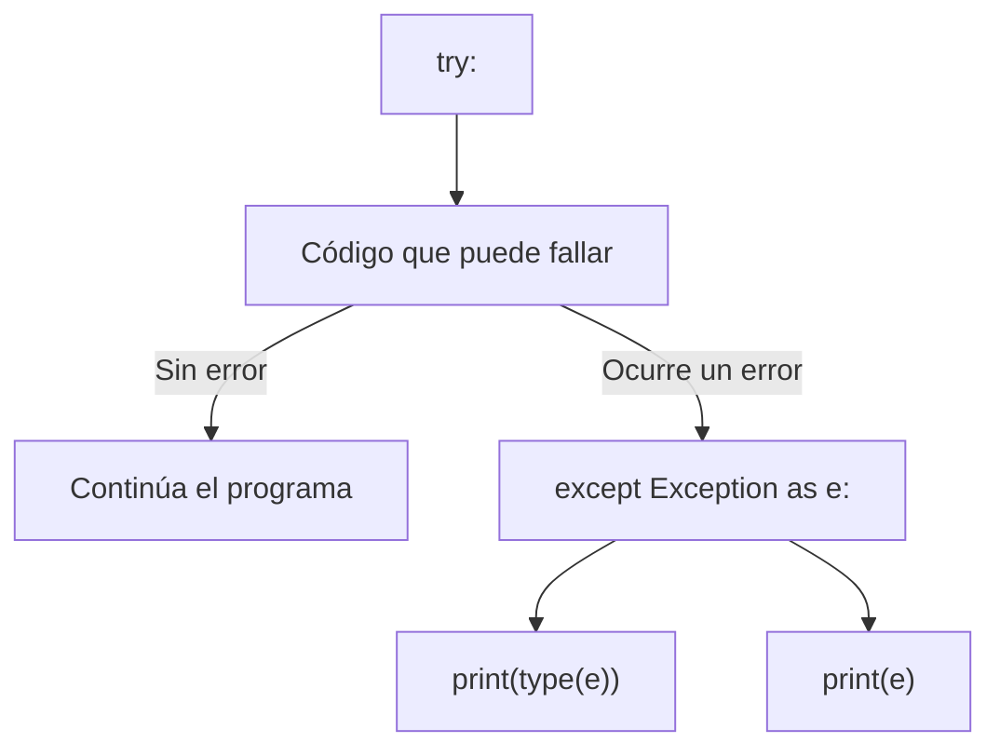

# Laboratorio 1.5 – Manejo de excepciones

## Objetivo de la práctica:
Al finalizar la práctica, serás capaz de:
- Identificar y provocar intencionalmente distintos tipos de excepciones predefinidas de Python.
- Reforzar el uso del bloque `try/except` para capturar y describir errores en tiempo de ejecución.
- Consultar la documentación oficial de excepciones de Python como referencia de consulta.

## Objetivo Visual


## Duración aproximada:
- 15 minutos.

## Tabla de ayuda:
| Herramienta | Versión / Detalle | Notas |
| --- | --- | --- |
| Visual Studio Code | Última versión estable | |
| Python | 3.10 o superior | |
| Carpeta de trabajo | `ws_curso` | |
| Nombre de archivo sugerido | `p1_5.py` | |
| Documentación | docs.python.org/3/library/exceptions.html | Referencia oficial de excepciones incorporadas |

## Instrucciones

### Tarea 1. Preparar el archivo base
Paso 1. En la carpeta `ws_curso`, crear un archivo de nombre `p1_5.py`.

Paso 2. Capturar el siguiente bloque de código, que ya contiene el primer caso resuelto (`ZeroDivisionError`) y ocho bloques `try/except` pendientes de completar:

```python
try:
    1/0
except Exception as e:
    print(type(e))
    print(e, '\n')

try:
    pass  # Ingrese el código para generar la excepción ValueError
except Exception as e:
    print(type(e))
    print(e, '\n')

try:
    pass  # Ingrese el código para generar la excepción NameError
except Exception as e:
    print(type(e))
    print(e, '\n')

try:
    pass  # Ingrese el código para generar la excepción FileNotFoundError
except Exception as e:
    print(type(e))
    print(e, '\n')

try:
    pass  # Ingrese el código para generar la excepción ImportError
except Exception as e:
    print(type(e))
    print(e, '\n')

try:
    pass  # Ingrese el código para generar la excepción TypeError
except Exception as e:
    print(type(e))
    print(e, '\n')

try:
    pass  # Ingrese el código para generar la excepción AttributeError
except Exception as e:
    print(type(e))
    print(e, '\n')

try:
    pass  # Ingrese el código para generar la excepción StopIteration
except Exception as e:
    print(type(e))
    print(e, '\n')

try:
    pass  # Ingrese el código para generar la excepción KeyError
except Exception as e:
    print(type(e))
    print(e, '\n')
```

> **¿Qué hace el bloque ya resuelto?** `1/0` intenta dividir `1` entre `0`, algo matemáticamente indefinido; Python lo señala levantando una excepción `ZeroDivisionError` **antes** de que el programa se detenga por completo, porque el bloque `except Exception as e` la intercepta. Después imprime el **tipo** de la excepción (`type(e)`) y su **mensaje** (`e`).
>
> 💡 **Buena práctica:** capturar `Exception` de forma genérica —como aquí— es útil con fines didácticos para explorar tipos de error, pero en código de producción es preferible capturar el tipo específico esperado (por ejemplo `except ValueError:`), para no ocultar accidentalmente errores distintos a los que realmente esperas manejar.

### Tarea 2. Generar excepciones de conversión y de referencia
Paso 1. Completar el segundo bloque para generar un `ValueError`, intentando convertir un texto no numérico a entero:

```python
int("abc")
```

> **¿Por qué genera `ValueError`?** La función `int()` sabe convertir cadenas de texto a enteros, pero solo cuando el contenido representa un número válido (`"123"`). `"abc"` tiene el tipo correcto (`str`), pero un **valor** inadecuado para la conversión — de ahí el nombre `ValueError`.

Paso 2. Completar el tercer bloque para generar un `NameError`, haciendo referencia a una variable que no ha sido definida:

```python
print(variable_no_definida)
```

> **¿Por qué genera `NameError`?** Python busca `variable_no_definida` en el espacio de nombres disponible y, al no encontrarla, no puede continuar: el nombre en sí no existe.

Paso 3. Completar el sexto bloque para generar un `TypeError`, combinando tipos de datos incompatibles en una operación:

```python
"2" + 2
```

> **¿Por qué genera `TypeError`?** El operador `+` está sobrecargado para trabajar entre dos cadenas (concatenación) o entre dos números (suma), pero no sabe cómo combinar un `str` con un `int`: el **tipo** de uno de los operandos es incompatible con la operación.

### Tarea 3. Generar excepciones de acceso a recursos y atributos
Paso 1. Completar el cuarto bloque para generar un `FileNotFoundError`, intentando abrir un archivo que no existe:

```python
open("archivo_que_no_existe.txt")
```

Paso 2. Completar el quinto bloque para generar un `ImportError`, intentando importar un módulo inexistente:

```python
import modulo_que_no_existe
```

> Nota: en versiones recientes de Python, importar un módulo inexistente en realidad levanta `ModuleNotFoundError`, que es una **subclase** de `ImportError` — por lo que el bloque `except Exception` lo captura igualmente, y `type(e)` mostrará `<class 'ModuleNotFoundError'>`.

Paso 3. Completar el séptimo bloque para generar un `AttributeError`, invocando un método inexistente sobre un objeto válido:

```python
"texto".metodo_que_no_existe()
```

> **¿Por qué genera `AttributeError`?** El objeto `"texto"` (de tipo `str`) existe, pero no tiene un atributo o método con ese nombre — el error ocurre al intentar **acceder** a algo que el objeto no posee.

Paso 4. Completar el noveno bloque para generar un `KeyError`, accediendo a una clave inexistente de un diccionario:

```python
diccionario = {"a": 1, "b": 2}
diccionario["c"]
```

### Tarea 4. Generar una excepción de iteración agotada
Paso 1. Completar el octavo bloque para generar un `StopIteration`, agotando un iterador y solicitando un valor adicional con `next()`:

```python
iterador = iter([1, 2])
next(iterador)
next(iterador)
next(iterador)  # ya no quedan elementos
```

> **¿Por qué genera `StopIteration`?** Un iterador recuerda su posición y entrega un valor a la vez. Cuando ya no tiene más elementos que entregar y se le solicita otro con `next()`, señala que llegó a su fin levantando `StopIteration` — es el mecanismo interno que, por ejemplo, usa un ciclo `for` para saber cuándo detenerse.

### Tarea 5. Ejecutar, comparar y documentar
Paso 1. Guardar y ejecutar el archivo completo desde la terminal (`python p1_5.py`).

Paso 2. Comparar el tipo y el mensaje impresos por cada bloque con la descripción oficial en la [documentación de excepciones de Python](https://docs.python.org/3/library/exceptions.html).

Paso 3. Anotar, para cada excepción, en qué situación real de un programa podría presentarse sin haber sido provocada intencionalmente (por ejemplo, `FileNotFoundError` al leer un archivo de configuración que el usuario borró).

### Resultado esperado
La ejecución debe imprimir, para cada bloque, el tipo de excepción seguido de su mensaje, similar a:

```
<class 'ZeroDivisionError'>
division by zero

<class 'ValueError'>
invalid literal for int() with base 10: 'abc'

<class 'NameError'>
name 'variable_no_definida' is not defined

<class 'FileNotFoundError'>
[Errno 2] No such file or directory: 'archivo_que_no_existe.txt'

<class 'ModuleNotFoundError'>
No module named 'modulo_que_no_existe'

<class 'TypeError'>
can only concatenate str (not "int") to str

<class 'AttributeError'>
'str' object has no attribute 'metodo_que_no_existe'

<class 'StopIteration'>

<class 'KeyError'>
'c'
```

> Nota: el mensaje exacto de `StopIteration` suele ir vacío, y los mensajes de `FileNotFoundError`, `TypeError` o `ModuleNotFoundError` pueden variar ligeramente según tu versión de Python — lo importante es identificar el **tipo** de excepción y comprender su causa.
