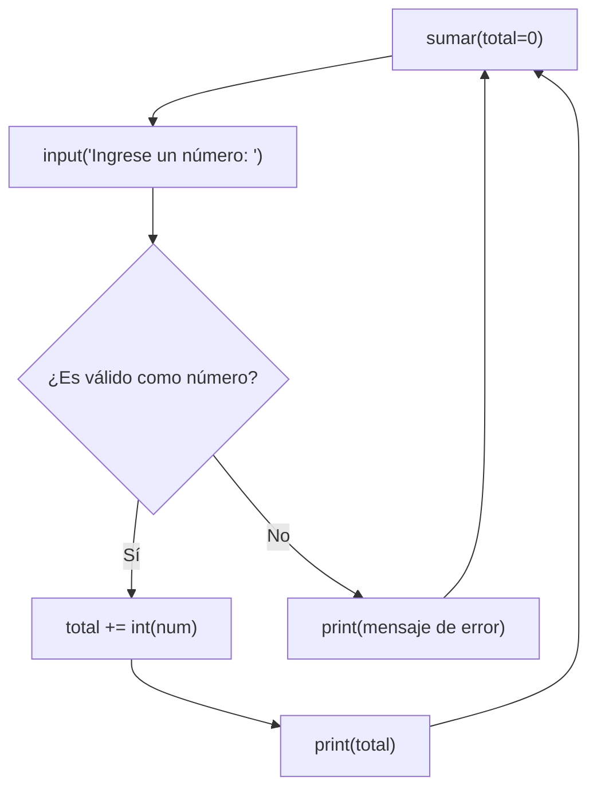

# Laboratorio 1.6 – Sumar indefinidamente

## Objetivo de la práctica:
Al finalizar la práctica, serás capaz de:
- Alterar el flujo de un programa utilizando `try/except` en lugar de estructuras `if-else` tradicionales.
- Comprender las ventajas de la gestión de excepciones frente a la validación manual de condiciones.
- Practicar el uso de funciones recursivas en Python.

## Objetivo Visual


## Duración aproximada:
- 12 minutos.

## Tabla de ayuda:
| Herramienta | Versión / Detalle | Notas |
| --- | --- | --- |
| Visual Studio Code | Última versión estable | |
| Python | 3.10 o superior | |
| Carpeta de trabajo | `ws_curso` | |
| Nombre de archivo | `p2_6.py` | |
| Atajo para detener | `Ctrl + C` | El programa se ejecuta en un ciclo indefinido por diseño |

## Instrucciones

### Tarea 1. Preparar y ejecutar la versión original con `if-else`
Paso 1. En la carpeta `ws_curso`, crear el archivo `p2_6.py` y capturar el siguiente código:

```python
# Función suma recursiva, salir con [Ctrl]+C
def sumar(total=0):
    num = input('Ingrese un número: ')

    if not num.isdigit():
        print('Ingrese solamente números, intente nuevamente.')
    else:
        total += int(num)
        print('El total actual es:', total)

    sumar(total)

def main():
    sumar()

main()
```

> **¿Qué hace este código?** `sumar()` es una función **recursiva**: al final de su propio cuerpo se llama a sí misma nuevamente (`sumar(total)`), pasando el total acumulado hasta el momento. Esto crea un ciclo indefinido de solicitud de números, ya que cada llamada genera una nueva llamada.
>
> **¿Qué hace `num.isdigit()`?** Es un método de las cadenas de texto que devuelve `True` únicamente si **todos** los caracteres de la cadena son dígitos (`0`-`9`). Se usa aquí como validación manual antes de convertir la entrada a entero con `int()`.
>
> **¿Por qué el parámetro `total=0`?** Es un parámetro con valor por defecto: en la primera llamada (`sumar()` desde `main()`) no se indica ningún argumento, así que `total` inicia en `0`; en cada llamada recursiva posterior, se pasa explícitamente el acumulado más reciente.

Paso 2. Ejecutar el script (`python p2_6.py`) e ingresar varios números consecutivos para observar cómo se acumula el total.

Paso 3. Probar también ingresar un valor no numérico (por ejemplo, una palabra) y observar el mensaje de validación.

Paso 4. Detener la ejecución con `Ctrl + C`, ya que el programa fue diseñado para ejecutarse indefinidamente.

> **Resultado esperado:**
> ```
> Ingrese un número: 5
> El total actual es: 5
> Ingrese un número: 3
> El total actual es: 8
> Ingrese un número: hola
> Ingrese solamente números, intente nuevamente.
> Ingrese un número: ^C
> ```

### Tarea 2. Analizar las limitaciones del enfoque `if-else`
Paso 1. Probar el programa ingresando un número negativo, como `-5`.

Paso 2. Observar que `isdigit()` considera inválido el signo `-`, por lo que un número negativo válido es rechazado por el programa como si fuera texto no numérico.

> **Explicación:** `isdigit()` solo reconoce dígitos del `0` al `9`; no contempla signos (`-`, `+`) ni separadores decimales (`.`), lo cual limita la validación a números enteros positivos únicamente. Esta es una de las razones por las que, en muchos casos, resulta más robusto **intentar la conversión directamente** y capturar el error si falla, en lugar de intentar anticipar manualmente todos los casos válidos e inválidos.

### Tarea 3. Refactorizar la función usando `try/except`
Paso 1. Sustituir el bloque `if-else` por un bloque `try/except`, de modo que la conversión a entero se intente directamente y solo se maneje el error si ocurre:

```python
def sumar(total=0):
    num = input('Ingrese un número: ')

    try:
        total += int(num)
        print('El total actual es:', total)
    except ValueError:
        print('Ingrese solamente números, intente nuevamente.')

    sumar(total)
```

> **¿Qué hace este código?** En lugar de validar primero con `isdigit()` y convertir después, se intenta la conversión `int(num)` de inmediato dentro del bloque `try`. Si `num` no puede convertirse a entero, Python levanta un `ValueError`, que el bloque `except ValueError` captura para mostrar el mismo mensaje de aviso que en la versión original.
>
> **¿Por qué se usa este enfoque?** Este patrón se conoce como EAFP (*Easier to Ask Forgiveness than Permission*, "es más fácil pedir perdón que permiso"), muy común en Python: en lugar de verificar exhaustivamente todas las condiciones antes de actuar, se intenta la operación y se maneja el error si no fue posible. Tiene además una ventaja funcional sobre la validación con `isdigit()`: `int()` sí acepta correctamente números negativos como `"-5"`, algo que la validación manual anterior rechazaba incorrectamente.
>
> **Resultado esperado:** idéntico en apariencia al de la Tarea 1 para las mismas entradas, pero ahora un valor como `-5` se acepta correctamente como número válido.

Paso 2. Ejecutar la nueva versión y repetir las mismas pruebas de la Tarea 1 y la Tarea 2 (números positivos, texto no numérico y un número negativo).

### Tarea 4. Comparar ambas versiones
Paso 1. Ejecutar ambas versiones del programa (la original con `if-else` y la refactorizada con `try/except`) usando las mismas entradas de prueba.

Paso 2. Documentar en una tabla o lista las diferencias observadas, incluyendo al menos el caso de un número negativo.

> 💡 **Buena práctica:** cuando la validación manual de una condición (como `isdigit()`) no cubre todos los casos válidos que tu programa debe aceptar, evalúa si un bloque `try/except` alrededor de la operación real (como la conversión con `int()`) ofrece una solución más simple y correcta.

### Resultado esperado
Con la versión basada en `try/except`, la ejecución con las entradas `5`, `-3`, `hola` debe verse así:

```
Ingrese un número: 5
El total actual es: 5
Ingrese un número: -3
El total actual es: 2
Ingrese un número: hola
Ingrese solamente números, intente nuevamente.
Ingrese un número: ^C
```
