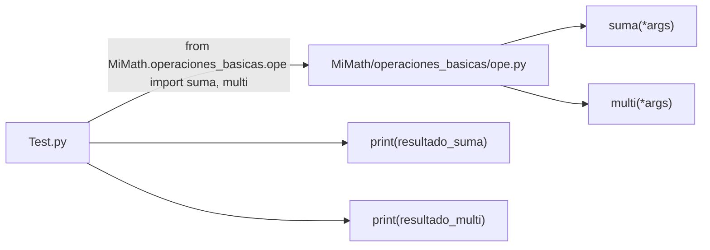

# Laboratorio 2.2 – Módulos y programa principal

## Objetivo de la práctica:
Al finalizar la práctica, serás capaz de:
- Crear un programa principal que haga uso del paquete de operaciones definido en la práctica 2.1.
- Importar funciones específicas desde un módulo anidado dentro de un paquete y subpaquete.
- Comprender el propósito del directorio `__pycache__` y cómo evitar salidas no deseadas al importar un módulo.

## Objetivo Visual


## Duración aproximada:
- 20 minutos.

## Tabla de ayuda:
| Herramienta | Versión / Detalle | Notas |
| --- | --- | --- |
| Python | 3.10 o superior | |
| Visual Studio Code | Última versión estable | |
| Carpeta de trabajo | `ws_curso` | `Test.py` debe crearse al mismo nivel que la carpeta `MiMath` |
| Archivo a crear | `Test.py` | |
| Requisito previo | Paquete `MiMath` de la práctica 2.1 | Debe existir en la misma carpeta `ws_curso` |

## Instrucciones

### Tarea 1. Evitar salidas no deseadas al importar el módulo
Paso 1. Antes de crear `Test.py`, regresar al archivo `ope.py` de la práctica 2.1 y localizar las líneas de prueba que agregaste al final:

```python
print(suma(1, 2, 3))
print(multi(1, 2, 3))
```

Paso 2. Envolver esas líneas dentro de un bloque `if __name__ == "__main__":`.

```python
if __name__ == "__main__":
    print(suma(1, 2, 3))
    print(multi(1, 2, 3))
```

> **¿Qué hace `__name__`?** Cada módulo de Python tiene una variable especial llamada `__name__`. Cuando un archivo se ejecuta **directamente** (por ejemplo con `python ope.py`), Python le asigna a `__name__` el valor `"__main__"`. En cambio, cuando ese mismo archivo se **importa** desde otro programa (como haremos en esta práctica), `__name__` toma el valor del nombre del módulo (`"ope"`), no `"__main__"`.
>
> **¿Por qué se usa este enfoque?** Este condicional asegura que el código de prueba dentro de él **solo se ejecute cuando el archivo se corre directamente**, y se omita por completo cuando el archivo se importa como parte de otro programa. Es la razón por la que este patrón es prácticamente un estándar en cualquier módulo de Python que también pueda ejecutarse de forma independiente.
>
> **Resultado esperado:** al ejecutar `python ope.py` directamente, la salida sigue siendo `6` y `6`, igual que antes. Pero al importar `ope` desde otro archivo, esas dos líneas ya no se ejecutarán.

### Tarea 2. Crear el programa principal
Paso 1. En la carpeta `ws_curso` (al mismo nivel que la carpeta `MiMath`, **no** dentro de ella), crear un archivo de nombre `Test.py`.

> **¿Por qué debe estar en ese nivel?** Python busca los paquetes a importar en el directorio desde el cual se ejecuta el script (entre otras ubicaciones). Si `Test.py` está en el mismo nivel que `MiMath/`, Python podrá encontrar el paquete sin configuración adicional.

Paso 2. En `Test.py`, importar las funciones `suma` y `multi` desde el módulo `ope`, dentro del subpaquete `operaciones_basicas`, dentro del paquete `MiMath`.

```python
from MiMath.operaciones_basicas.ope import suma, multi
```

> **¿Qué hace esta instrucción?** Es una sentencia `from-import` con una ruta de importación de tres niveles: paquete (`MiMath`) → subpaquete (`operaciones_basicas`) → módulo (`ope`). Al final, importa directamente los nombres `suma` y `multi`, por lo que podrás invocarlos sin tener que escribir el prefijo completo cada vez.

### Tarea 3. Calcular y desplegar los resultados
Paso 1. Declarar una lista con los números `2, 3, 5, 7, 11, 13` y usarla para invocar ambas funciones, desempaquetando sus elementos como argumentos individuales.

```python
numeros = [2, 3, 5, 7, 11, 13]

resultado_suma = suma(*numeros)
resultado_multi = multi(*numeros)
```

> **¿Qué hace `*numeros` aquí?** A diferencia de `*args` en la definición de una función (que **empaqueta** argumentos), usar `*` al **invocar** una función **desempaqueta** una lista o tupla en argumentos individuales. Es decir, `suma(*numeros)` es equivalente a escribir `suma(2, 3, 5, 7, 11, 13)` directamente.
>
> **¿Por qué se usa este enfoque en lugar de escribir cada número manualmente?** Porque permite trabajar con colecciones de tamaño variable (por ejemplo, una lista leída de un archivo) sin tener que conocer de antemano cuántos elementos contiene.

Paso 2. Desplegar únicamente los dos resultados solicitados.

```python
print("Suma:", resultado_suma)
print("Multiplicación:", resultado_multi)
```

> **Resultado esperado:**
> ```
> Suma: 41
> Multiplicación: 30030
> ```
> **Explicación:** `2+3+5+7+11+13 = 41`, y `2*3*5*7*11*13 = 30030`.

Paso 3. Ejecutar `Test.py` desde la terminal y confirmar que los **únicos** mensajes desplegados sean los dos anteriores (sin los `6` y `6` de la práctica 2.1).

```bash
python Test.py
```

> **Explicación:** gracias al `if __name__ == "__main__":` agregado en la Tarea 1, al importar `ope` desde `Test.py` el valor de `__name__` dentro de `ope.py` es `"MiMath.operaciones_basicas.ope"` (no `"__main__"`), por lo que las líneas de prueba de la práctica anterior se omiten automáticamente.

### Tarea 4. Verificar el directorio `__pycache__`
Paso 1. Después de ejecutar `Test.py`, revisar el contenido de la carpeta `operaciones_basicas`.

Paso 2. Confirmar la aparición de una nueva carpeta llamada `__pycache__`, con un archivo dentro con una extensión similar a `ope.cpython-311.pyc`.

> **¿Cuál es el uso del directorio `__pycache__`?** Cuando Python importa un módulo, primero lo compila a **bytecode** (un formato intermedio más rápido de ejecutar que el código fuente). Python guarda ese bytecode compilado en `__pycache__` para no tener que recompilar el módulo cada vez que se importe, siempre que el archivo fuente no haya cambiado — esto acelera las importaciones posteriores.
>
> 💡 **Buena práctica:** la carpeta `__pycache__` se genera automáticamente y **no debe incluirse** en un repositorio de control de versiones (por ejemplo, agregándola a un archivo `.gitignore`), ya que es contenido derivado que Python puede regenerar en cualquier momento.

### Resultado esperado
Al ejecutar `python Test.py`, la consola debe mostrar exactamente:

```
Suma: 41
Multiplicación: 30030
```

Y la estructura de carpetas debe incluir el nuevo directorio de caché:

```
ws_curso/
├── Test.py
└── MiMath/
    ├── __init__.py
    └── operaciones_basicas/
        ├── __init__.py
        ├── ope.py
        └── __pycache__/
            └── ope.cpython-311.pyc
```
