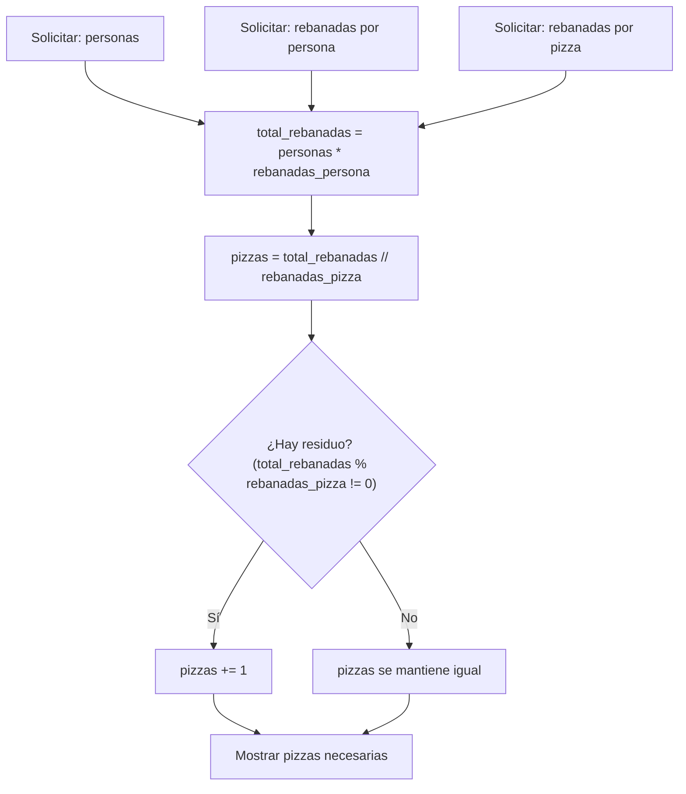

# Laboratorio 2.4 – Pizzas

## Objetivo de la práctica:
Al finalizar la práctica, serás capaz de:
- Repasar el uso de operadores, expresiones y funciones vistos hasta este punto del curso.
- Escribir un programa completo desde cero que resuelva un problema del mundo real.
- Aplicar los operadores de división entera (`//`) y módulo (`%`) para resolver un problema de reparto con residuo.

## Objetivo Visual


## Duración aproximada:
- 20 minutos.

## Tabla de ayuda:
| Herramienta | Versión / Detalle | Notas |
| --- | --- | --- |
| Visual Studio Code | Última versión estable | |
| Python | 3.10 o superior | |
| Carpeta de trabajo | `ws_curso` | |
| Nombre de archivo sugerido | `p3_4.py` | |

## Instrucciones

### Tarea 1. Solicitar los datos al usuario
Paso 1. En la carpeta `ws_curso`, crear un archivo de nombre `p3_4.py`.

Paso 2. Solicitar al usuario, mediante `input()`, tres datos: el número de personas, el número de rebanadas que comerá cada persona y el número de rebanadas por pizza. Convertir cada respuesta a entero con `int()`.

```python
personas = int(input("¿Cuántas personas comerán pizza? "))
rebanadas_persona = int(input("¿Cuántas rebanadas comerá cada persona? "))
rebanadas_pizza = int(input("¿Cuántas rebanadas tiene cada pizza? "))
```

> **¿Por qué se usa `int()` alrededor de `input()`?** Como viste en la práctica 1.3, `input()` siempre devuelve una cadena de texto (`str`). Como en este programa necesitamos **operar aritméticamente** con estos valores (multiplicar, dividir), es indispensable convertirlos a `int` antes de usarlos en cálculos; de lo contrario, el operador `*` intentaría repetir texto en lugar de multiplicar números.

### Tarea 2. Calcular el total de rebanadas necesarias
Paso 1. Calcular cuántas rebanadas se necesitan en total, multiplicando el número de personas por las rebanadas que comerá cada una.

```python
total_rebanadas = personas * rebanadas_persona
```

> **¿Qué hace este código?** Aplica el operador aritmético `*` (multiplicación) para obtener el total de rebanadas que deberá cubrir el pedido de pizzas.
>
> **Resultado esperado (ejemplo con 8 personas y 3 rebanadas cada una):** `total_rebanadas` queda con el valor `24`.

### Tarea 3. Calcular el número de pizzas necesarias
Paso 1. Calcular cuántas pizzas completas se obtienen del total de rebanadas, usando el operador de división entera `//`.

```python
pizzas = total_rebanadas // rebanadas_pizza
```

> **¿Qué hace el operador `//`?** A diferencia de `/` (que devuelve un resultado decimal, por ejemplo `24 / 8 = 3.0`), el operador `//` realiza una **división entera**: descarta cualquier parte decimal y devuelve solo la parte entera del cociente. Es el operador correcto aquí porque el número de pizzas debe ser un entero.

Paso 2. Determinar si sobran rebanadas después de repartir en pizzas completas, usando el operador módulo `%`, y si es así, sumar una pizza adicional.

```python
if total_rebanadas % rebanadas_pizza != 0:
    pizzas += 1
```

> **¿Qué hace el operador `%`?** Devuelve el **residuo** (lo que sobra) de una división entera. Por ejemplo, `10 % 8` es `2`, porque `10` contiene una vez a `8`, con `2` de sobra.
>
> **¿Por qué es necesario este paso?** Si el total de rebanadas no es múltiplo exacto del tamaño de la pizza, sobrarán rebanadas incompletas de una pizza adicional que igualmente hay que comprar. Por ejemplo, con `10` rebanadas necesarias y pizzas de `8` rebanadas: `10 // 8 = 1` pizza completa, pero quedan `10 % 8 = 2` rebanadas sin cubrir, por lo que se necesita una pizza más (`pizzas = 2` en total), aunque no se consuma por completo.

### Tarea 4. Desplegar el resultado
Paso 1. Mostrar al usuario, con un mensaje claro, cuántas pizzas se necesitan.

```python
print(f"Se necesitan {pizzas} pizzas para {personas} personas.")
```

> **¿Qué es una cadena f (f-string)?** Es una forma de formatear cadenas de texto colocando una `f` antes de las comillas, lo que permite insertar el valor de variables directamente dentro de `{}` sin tener que concatenar manualmente con `+`. Es más legible que escribir `"Se necesitan " + str(pizzas) + " pizzas..."`.

### Tarea 5. Probar el programa con distintos escenarios
Paso 1. Ejecutar el programa con un caso donde el reparto es exacto: `8` personas, `3` rebanadas cada una, `8` rebanadas por pizza.

Paso 2. Ejecutar el programa con un caso donde sobran rebanadas: `5` personas, `2` rebanadas cada una, `8` rebanadas por pizza.

Paso 3. Comparar ambos resultados y confirmar que el segundo caso redondea hacia arriba correctamente.

### Resultado esperado
**Caso 1 (reparto exacto):**
```
¿Cuántas personas comerán pizza? 8
¿Cuántas rebanadas comerá cada persona? 3
¿Cuántas rebanadas tiene cada pizza? 8
Se necesitan 3 pizzas para 8 personas.
```

**Caso 2 (con residuo):**
```
¿Cuántas personas comerán pizza? 5
¿Cuántas rebanadas comerá cada persona? 2
¿Cuántas rebanadas tiene cada pizza? 8
Se necesitan 2 pizzas para 5 personas.
```

> **Verificación del caso 2:** `total_rebanadas = 5 * 2 = 10`. `pizzas = 10 // 8 = 1`. Como `10 % 8 = 2 != 0`, se suma una pizza adicional: `pizzas = 2`. Con 2 pizzas de 8 rebanadas (16 en total) se cubren las 10 rebanadas necesarias, con 6 de sobra.
