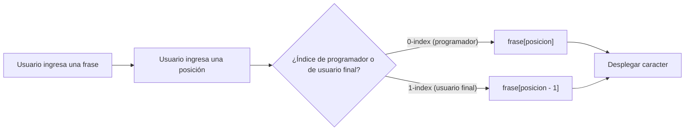

# Laboratorio 3.1 – Cadenas de indexación

## Objetivo de la práctica:
Al finalizar la práctica, serás capaz de:
- Reafirmar el uso de índices para acceder a caracteres individuales dentro de una cadena de texto.
- Aplicar cadenas formateadas (f-strings) para construir mensajes que combinan texto y variables.
- Distinguir entre el índice que usa Python internamente (comienza en 0) y el índice que espera un usuario final (comienza en 1), y ajustar un programa para cerrar esa brecha.

## Objetivo Visual


## Duración aproximada:
- 20 minutos.

## Tabla de ayuda:
| Herramienta | Versión / Detalle | Notas |
| --- | --- | --- |
| Visual Studio Code | Última versión estable | |
| Python | 3.10 o superior | |
| Carpeta de trabajo | `ws_curso` | |
| Nombre de archivo | `p3_1.py` | Indicado explícitamente en el enunciado de la práctica |

## Instrucciones

### Tarea 1. Crear el programa con indexación estándar (0-index)
Paso 1. En la carpeta `ws_curso`, crear un archivo de nombre `p3_1.py`.

Paso 2. Definir una función `main()` que solicite al usuario una frase y la almacene en una variable de nombre `frase`.

```python
def main():
    frase = input("Ingresa un frase y pulsa [Enter]: ")
    print(f"Tu frase es: '{frase}'")
```

> **¿Qué hace `print(f"Tu frase es: '{frase}'")`?** Es una cadena formateada (f-string): al anteponer `f` a las comillas, cualquier expresión entre `{}` se sustituye por su valor al imprimir. Aquí además envuelve la frase entre comillas simples literales, tal como pide el enunciado.

Paso 3. Dentro de la misma función, solicitar al usuario un número entero y almacenarlo en una variable de nombre `posicion`.

```python
    posicion = int(input("¿Qué caracter quieres desplegar? [Número & Enter] "))
```

Paso 4. Obtener el carácter que se encuentra en esa posición dentro de la frase, e indicarlo al usuario con una cadena formateada.

```python
    caracter = frase[posicion]
    print(f"El caracter en la posición  {posicion} es {caracter}")

main()
```

> **¿Qué hace `frase[posicion]`?** Aplica el operador de indexación `[]` sobre la cadena `frase`, devolviendo el carácter individual que ocupa esa posición. En Python, **las cadenas se indexan desde cero**: el primer carácter está en la posición `0`, el segundo en la `1`, y así sucesivamente.
>
> **Resultado esperado (frase "Hola mundo cruel", posición 5):**
> ```
> Ingresa un frase y pulsa [Enter]: Hola mundo cruel
> Tu frase es: 'Hola mundo cruel'
> ¿Qué caracter quieres desplegar? [Número & Enter] 5
> El caracter en la posición  5 es m
> ```
> **Verificación:** contando desde cero — `H`(0) `o`(1) `l`(2) `a`(3) ` `(4) `m`(5) — el carácter en la posición 5 es, en efecto, `m`.

### Tarea 2. Identificar el problema de experiencia de usuario
Paso 1. Ejecutar el programa con la frase `"Hola mundo"` y solicitar el carácter en la posición `5`.

Paso 2. Observar que el programa reporta correctamente `m` como resultado — comportamiento correcto **desde la perspectiva de un programador** que sabe que Python indexa desde cero.

Paso 3. Reflexionar: un usuario sin conocimientos de programación, al ver la palabra "mundo" y contar con los dedos, identificaría la `m` como el **sexto** carácter (contando desde 1), no el quinto. Para ese usuario, el programa parecería estar "mal".

> **Explicación:** este es un ejemplo clásico de la diferencia entre un **índice basado en cero** (el que usan internamente casi todos los lenguajes de programación, incluido Python) y un **índice basado en uno** (la forma natural en que las personas cuentan objetos en la vida cotidiana). Ninguno de los dos es "incorrecto" — parten de convenciones distintas — pero un programa pensado para usuarios finales debe hablar en los términos que ellos esperan.

### Tarea 3. Adaptar el programa para el usuario final
Paso 1. Crear una copia del archivo con el nombre `p3_1_reto.py`.

Paso 2. Modificar la línea donde se accede al carácter, restando `1` a la posición ingresada por el usuario antes de indexar la cadena.

```python
def main():
    frase = input("Ingresa un frase y pulsa [Enter]: ")
    print(f"Tu frase es: '{frase}'")
    posicion = int(input("¿Qué caracter quieres desplegar? [Número & Enter] "))
    caracter = frase[posicion - 1]
    print(f"El caracter en la posición  {posicion} es {caracter}")

main()
```

> **¿Qué hace `frase[posicion - 1]`?** Convierte el número que el usuario tiene en mente (donde el primer carácter es el "1") al índice real que Python necesita (donde el primer carácter es el "0"). Al usuario se le sigue mostrando el número tal como lo ingresó (`posicion`), pero internamente el programa consulta la posición correcta.
>
> **¿Por qué este pequeño ajuste importa tanto?** Ilustra un principio de diseño de software: la forma en que un programa **piensa internamente** (índices desde cero) no tiene por qué ser la forma en que **se comunica** con quien lo usa. Adaptar la interfaz al modelo mental del usuario, sin sacrificar la lógica interna correcta, es una habilidad clave al construir herramientas para personas no técnicas.

Paso 3. Ejecutar `p3_1_reto.py` con la frase `"Hola Mundo cruel"` y la posición `6`.

> **Resultado esperado:**
> ```
> Ingresa un frase y pulsa [Enter]: Hola Mundo cruel
> Tu frase es: 'Hola Mundo cruel'
> ¿Qué caracter quieres desplegar? [Número & Enter] 6
> El caracter en la posición  6 es M
> ```
> **Verificación:** contando desde 1 — `H`(1) `o`(2) `l`(3) `a`(4) ` `(5) `M`(6) — el sexto carácter para el usuario es `M`. Internamente, el programa accedió a `frase[6-1]`, es decir `frase[5]`, que en el índice real de Python (desde 0) también corresponde a `M`.

### Resultado esperado
**Versión `p3_1.py` (índice de programador, desde 0):**
```
Ingresa un frase y pulsa [Enter]: Sigue al conejo blanco
Tu frase es: 'Sigue al conejo blanco'
¿Qué caracter quieres desplegar? [Número & Enter] 11
El caracter en la posición  11 es n
```

**Versión `p3_1_reto.py` (índice de usuario final, desde 1):**
```
Ingresa un frase y pulsa [Enter]: Hola Mundo cruel
Tu frase es: 'Hola Mundo cruel'
¿Qué caracter quieres desplegar? [Número & Enter] 6
El caracter en la posición  6 es M
```
