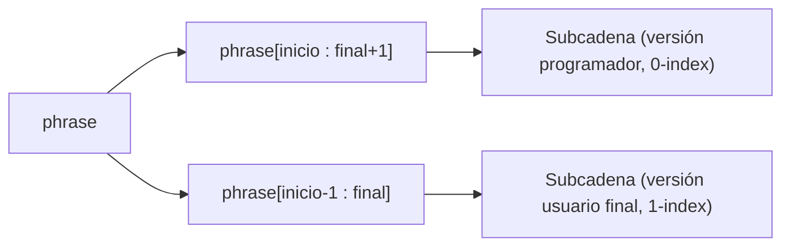

# Laboratorio 3.2 – Split de cadenas de caracteres

## Objetivo de la práctica:
Al finalizar la práctica, serás capaz de:
- Continuar reafirmando el uso de cadenas de caracteres.
- Aplicar el operador de *slicing* (`[inicio:fin]`) para extraer subcadenas de una cadena mayor.
- Adaptar un slicing pensado para programadores (índice desde 0) a una experiencia pensada para usuarios finales (índice desde 1), y analizar los casos límite que surgen al hacerlo.

## Objetivo Visual


## Duración aproximada:
- 15 minutos.

## Tabla de ayuda:
| Herramienta | Versión / Detalle | Notas |
| --- | --- | --- |
| Visual Studio Code | Última versión estable | |
| Python | 3.10 o superior | |
| Carpeta de trabajo | `ws_curso` | |
| Nombre de archivo sugerido | `p3_2.py` | |

## Instrucciones

### Tarea 1. Completar la función `main()` con slicing estándar
Paso 1. En la carpeta `ws_curso`, crear un archivo de nombre `p3_2.py` y capturar el fragmento de código inicial:

```python
def main():
    phrase = input("Ingrese una frase: ")
    # Escriba su código aquí

main()
```

Paso 2. Reemplazar el comentario, comenzando por desplegar la frase ingresada usando comillas simples.

```python
def main():
    phrase = input("Ingrese una frase: ")
    print(f"Su frase es: '{phrase}'")
```

Paso 3. Solicitar al usuario un número para el inicio de la subcadena y otro para el final, ambos como enteros.

```python
    inicio = int(input("¿Ingrese la posición del caracter inicial? "))
    final = int(input("¿Ingrese la posición del caracter final? "))
```

Paso 4. Obtener la subcadena que comienza en `inicio` y termina en `final` (incluyendo ese carácter), y mostrarla entre comillas simples.

```python
    subcadena = phrase[inicio:final + 1]
    print(f"La subcadena es: '{subcadena}'")

main()
```

> **¿Qué hace `phrase[inicio:final + 1]`?** El operador de *slicing* `[a:b]` extrae los caracteres desde la posición `a` hasta la posición `b`, **sin incluir** `b`. Como el enunciado pide que el carácter en la posición `final` sí quede incluido en el resultado, se le suma `1` al límite superior para compensar ese comportamiento de Python.
>
> **Resultado esperado (frase `"1234567890"`, inicio `3`, final `3`):**
> ```
> Ingrese una frase: 1234567890
> Su frase es: '1234567890'
> ¿Ingrese la posición del caracter inicial? 3
> ¿Ingrese la posición del caracter final? 3
> La subcadena es: '4'
> ```
> **Verificación:** `phrase[3:4]` extrae únicamente el carácter en el índice `3` (contando desde 0), que en `"1234567890"` es `'4'`.

### Tarea 2. Probar con un rango de varios caracteres
Paso 1. Ejecutar el programa nuevamente con la frase `"abcdefghijk"`, inicio `0` y final `4`.

> **Resultado esperado:**
> ```
> Ingrese una frase: abcdefghijk
> Su frase es: 'abcdefghijk'
> ¿Ingrese la posición del caracter inicial? 0
> ¿Ingrese la posición del caracter final? 4
> La subcadena es: 'abcde'
> ```
> **Verificación:** `phrase[0:5]` (recuerda el `+1`) extrae los caracteres en los índices `0` al `4`, es decir, `'abcde'`.

### Tarea 3. Adaptar el programa para un usuario final (índices desde 1)
Paso 1. Crear una copia del archivo con nombre `p3_2_reto.py`.

Paso 2. Modificar la línea del slicing para que `inicio` y `final` se interpreten como los usaría una persona sin conocimientos de programación — es decir, contando el primer carácter como `1`.

```python
    subcadena = phrase[inicio - 1:final]
```

> **¿Qué hace este cambio?** Al restar `1` únicamente al límite inferior, el rango `[inicio-1 : final]` traduce la posición "humana" `inicio` a su índice real de Python, y aprovecha que el límite superior de un slice ya excluye el último valor — por lo que `final`, tal cual lo ingresa el usuario, funciona directamente como límite superior sin necesidad de sumarle nada.
>
> **Resultado esperado (frase `"1234567890"`, inicio `3`, final `3`):**
> ```
> Ingrese una frase: 1234567890
> Su frase es: '1234567890'
> ¿Ingrese la posición del caracter inicial? 3
> ¿Ingrese la posición del caracter final? 3
> La subcadena es: '3'
> ```
> **Verificación:** `phrase[3-1:3]` es `phrase[2:3]`, que extrae el carácter en el índice `2` (`'3'`) — el tercer carácter si cuentas desde 1, tal como lo espera el usuario.

Paso 3. Ejecutar el programa con la frase `"abcdefghijk"`, inicio `1` y final `4`.

> **Resultado esperado:**
> ```
> Ingrese una frase: abcdefghijk
> Su frase es: 'abcdefghijk'
> ¿Ingrese la posición del caracter inicial? 1
> ¿Ingrese la posición del caracter final? 4
> La subcadena es: 'abcd'
> ```
> **Verificación:** `phrase[1-1:4]` es `phrase[0:4]`, es decir, los primeros cuatro caracteres contados desde 1: `'abcd'`.

### Tarea 4. Analizar un caso límite
Paso 1. Ejecutar `p3_2_reto.py` con la frase `"abcdefghijk"`, pero esta vez ingresando `0` como posición inicial y `4` como posición final.

Paso 2. Observar el resultado y contrastarlo con lo que esperarías intuitivamente.

> **Resultado esperado:**
> ```
> Ingrese una frase: abcdefghijk
> Su frase es: 'abcdefghijk'
> ¿Ingrese la posición del caracter inicial? 0
> ¿Ingrese la posición del caracter final? 4
> La subcadena es: ''
> ```
> **¿Por qué el resultado es una cadena vacía?** Al ingresar `inicio = 0`, el programa calcula `inicio - 1 = -1`. En Python, un índice **negativo** no significa "antes del principio": significa "contar desde el final de la cadena". Es decir, `phrase[-1:4]` le pide a Python que extraiga desde el **último** carácter (índice `-1`, equivalente al índice `10` en una cadena de 11 caracteres) hasta el carácter en el índice `4` — como el punto de inicio (10) queda **después** del punto final (4), el slice no tiene nada que recorrer y devuelve una cadena vacía.
>
> 💡 **Reflexión (buena práctica):** este comportamiento revela que nuestra adaptación para el usuario final tiene un caso límite sin resolver: el programa asume que el usuario nunca ingresará `0` como posición inicial (ya que, desde su perspectiva, el conteo empieza en `1`). Un programa robusto debería **validar la entrada** — por ejemplo, rechazando valores menores a `1` con un mensaje claro, en lugar de producir silenciosamente un resultado vacío y confuso. Como ejercicio adicional, intenta agregar esa validación con un bloque `if inicio < 1:`.

### Resultado esperado
Un resumen de las tres pruebas realizadas sobre `p3_2_reto.py`:

| Frase | Inicio (usuario) | Final (usuario) | Subcadena resultante |
| --- | --- | --- | --- |
| `1234567890` | 3 | 3 | `3` |
| `abcdefghijk` | 1 | 4 | `abcd` |
| `abcdefghijk` | 0 | 4 | *(vacía — caso límite a discutir)* |

