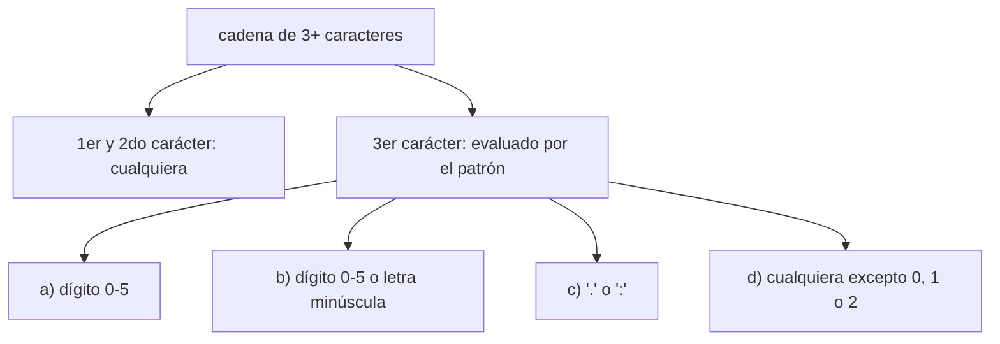

# Laboratorio 3.3 – Expresiones regulares

## Objetivo de la práctica:
Al finalizar la práctica, serás capaz de:
- Proveer la expresión regular adecuada para cada uno de los cuatro escenarios planteados, usando el módulo `re` de Python.
- Practicar la construcción de clases de caracteres (`[...]`) y clases negadas (`[^...]`) dentro de una expresión regular.
- Comprender el comportamiento de `re.match()` (evalúa desde el inicio de la cadena).

## Objetivo Visual


## Duración aproximada:
- 20 minutos.

## Tabla de ayuda:
| Herramienta | Versión / Detalle | Notas |
| --- | --- | --- |
| Python | 3.10 o superior | Incluye el módulo `re` en su biblioteca estándar |
| Visual Studio Code | Última versión estable | |
| Carpeta de trabajo | `ws_curso` | |
| Nombre de archivo sugerido | `p3_3.py` | |
| Herramienta de práctica | regex101.com o pythex.org | Útiles para probar expresiones regulares de forma interactiva antes de incorporarlas al script |

## Instrucciones

### Tarea 1. Preparar el archivo base
Paso 1. En la carpeta `ws_curso`, crear un archivo de nombre `p3_3.py` y capturar el siguiente esqueleto de código, tal como se entrega en el curso. Nota cómo el tercer bloque `for` imprime el separador de forma distinta a los otros tres — lo retomaremos en la Tarea 6.

```python
import re

codigos = ['se1', 'se9', 'ma2', 'se:', 'se.', 'se2', 'hu2', 'se3', 'sea', 'sec']
sep = "-" * 40

for ele in codigos:
    patron = None  # el 3er carácter puede ser nº de 0-5
    if re.match(patron, ele):
        print(ele)
    print(sep)

for ele in codigos:
    patron = None  # nº de 0 a 5 y letra de a a z
    if re.match(patron, ele):
        print(ele)
    print(sep)

for ele in codigos:
    patron = None  # el tercer carácter puede ser . ó :
    if re.match(patron, ele):
        print(ele)
        print(sep)

for ele in codigos:
    patron = None  # el tercer carácter no puede ser 0, 1 ni 2
    if re.match(patron, ele):
        print(ele)
    print(sep)
```

> **¿Qué hace `re.match(patron, ele)`?** Intenta hacer coincidir el `patron` (una expresión regular) contra el **inicio** de la cadena `ele`. Si la coincidencia tiene éxito, devuelve un objeto "match" (que en un `if` se evalúa como verdadero); si no, devuelve `None` (que se evalúa como falso).
>
> **¿Por qué el tercer bloque `for` se ve distinto?** En los bloques 1, 2 y 4, la instrucción `print(sep)` está **fuera** del `if`, por lo que el separador se imprime en **cada** iteración del ciclo, haya o no coincidencia. En el bloque 3, en cambio, `print(sep)` está **anidado dentro** del `if`, por lo que el separador solo aparece inmediatamente después de una coincidencia. Esta diferencia de indentación cambia notablemente la cantidad de líneas que se imprimen, como verás en el "Resultado esperado".

### Tarea 2. Expresión regular (a): el tercer carácter es un dígito del 0 al 5
Paso 1. Sustituir el primer `patron = None` por la expresión regular que valida esta condición.

```python
    patron = r'^..[0-5]'
```

> **¿Qué hace este patrón?** `^` ancla la búsqueda al inicio de la cadena (redundante junto con `re.match`, pero explícito y legible). Cada `.` coincide con **cualquier carácter** (el primero y el segundo de la cadena, sin importar cuáles sean). Finalmente, `[0-5]` es una **clase de caracteres** que coincide con un único dígito entre `0` y `5`, inclusive.
>
> **¿Por qué se usan dos puntos (`..`) en lugar de, por ejemplo, `se`?** Porque el enunciado pide evaluar únicamente el **tercer carácter** de la cadena, sin imponer ninguna condición sobre los dos primeros — `.` es el comodín que representa "cualquier carácter aquí".

### Tarea 3. Expresión regular (b): el tercer carácter es un dígito del 0 al 5 o una letra minúscula
Paso 1. Sustituir el segundo `patron = None`.

```python
    patron = r'^..[0-5a-z]'
```

> **¿Qué hace este patrón?** Es casi idéntico al anterior, pero la clase de caracteres ahora incluye dos rangos: `0-5` (dígitos) y `a-z` (letras minúsculas de la 'a' a la 'z'). Dentro de una clase de caracteres `[...]`, puedes combinar varios rangos simplemente escribiéndolos uno junto al otro.

### Tarea 4. Expresión regular (c): el tercer carácter es `.` o `:`
Paso 1. Sustituir el tercer `patron = None`.

```python
    patron = r'^..[.:]'
```

> **¿Qué hace este patrón?** La clase de caracteres `[.:]` coincide con un único carácter que sea `.` **o** `:`. Nota que **dentro** de una clase de caracteres `[...]`, el punto (`.`) pierde su significado especial de "cualquier carácter" y se interpreta de forma literal — por eso no es necesario escaparlo con `\.` en este caso particular.

### Tarea 5. Expresión regular (d): el tercer carácter no es 0, 1 ni 2
Paso 1. Sustituir el cuarto `patron = None`.

```python
    patron = r'^..[^012]'
```

> **¿Qué hace `[^012]`?** El símbolo `^` **al inicio de una clase de caracteres** (no al inicio de todo el patrón) invierte su significado: en lugar de "coincide con uno de estos caracteres", significa "coincide con cualquier carácter **que no sea** ninguno de estos". Así, `[^012]` coincide con cualquier carácter siempre que no sea `0`, `1` o `2` — incluyendo letras, símbolos y otros dígitos.
>
> 💡 **Buena práctica:** ten cuidado de no confundir el `^` de anclaje al inicio de un patrón (`^..`) con el `^` de negación dentro de una clase de caracteres (`[^012]`) — es el mismo símbolo, pero su significado depende completamente de su posición.

### Tarea 6. Ejecutar y verificar el resultado completo
Paso 1. Guardar y ejecutar `p3_3.py` desde la terminal.

```bash
python p3_3.py
```

Paso 2. Comparar la salida obtenida con la tabla de verificación manual de la siguiente sección, código por código.

Paso 3. Como cierre, identifica en tu propia salida el efecto descrito en la Tarea 1: ¿cuántas líneas separadoras aparecen en el bloque del patrón (c) comparado con los demás bloques? ¿Por qué?

### Resultado esperado
Antes de ver la salida completa, esta es la evaluación código por código para cada patrón (✔ = coincide, ✘ = no coincide):

| código | 3er carácter | (a) 0-5 | (b) 0-5 o a-z | (c) . ó : | (d) no 0,1,2 |
| --- | --- | --- | --- | --- | --- |
| se1 | `1` | ✔ | ✔ | ✘ | ✘ |
| se9 | `9` | ✘ | ✘ | ✘ | ✔ |
| ma2 | `2` | ✔ | ✔ | ✘ | ✘ |
| se: | `:` | ✘ | ✘ | ✔ | ✔ |
| se. | `.` | ✘ | ✘ | ✔ | ✔ |
| se2 | `2` | ✔ | ✔ | ✘ | ✘ |
| hu2 | `2` | ✔ | ✔ | ✘ | ✘ |
| se3 | `3` | ✔ | ✔ | ✘ | ✔ |
| sea | `a` | ✘ | ✔ | ✘ | ✔ |
| sec | `c` | ✘ | ✔ | ✘ | ✔ |

A partir de esta tabla, y recordando que `sep` son 40 guiones, la salida completa del script es:

```
se1
----------------------------------------
----------------------------------------
ma2
----------------------------------------
----------------------------------------
----------------------------------------
se2
----------------------------------------
hu2
----------------------------------------
se3
----------------------------------------
----------------------------------------
----------------------------------------
se1
----------------------------------------
----------------------------------------
ma2
----------------------------------------
----------------------------------------
----------------------------------------
se2
----------------------------------------
hu2
----------------------------------------
se3
----------------------------------------
sea
----------------------------------------
sec
----------------------------------------
se:
----------------------------------------
se.
----------------------------------------
----------------------------------------
se9
----------------------------------------
----------------------------------------
se:
----------------------------------------
se.
----------------------------------------
----------------------------------------
----------------------------------------
se3
----------------------------------------
sea
----------------------------------------
sec
----------------------------------------
```

> Nota: como se explicó en la Tarea 1, el bloque del patrón (c) es el único que produce una salida corta y limpia (`se:`, separador, `se.`, separador), porque su `print(sep)` está anidado dentro del `if`. Los otros tres bloques imprimen el separador en cada una de las 10 iteraciones, coincida o no, generando una salida mucho más larga.

