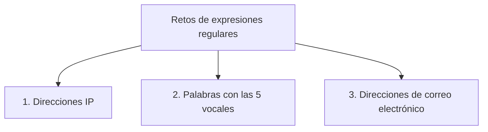

# Laboratorio 3.4 – Retos

## Objetivo de la práctica:
Al finalizar la práctica, serás capaz de:
- Realizar prácticas adicionales de expresiones regulares que profundizan lo visto en la práctica 3.3.
- Construir expresiones regulares para escenarios más realistas: validación de direcciones IP, búsqueda de patrones fonéticos y detección de direcciones de correo electrónico.

Esta práctica es **opcional**: está pensada como reto adicional para seguir practicando durante o después de la semana del curso, no como parte obligatoria de la evaluación.

## Objetivo Visual


## Duración aproximada:
- 25 minutos (opcional, sin límite estricto).

## Tabla de ayuda:
| Herramienta | Versión / Detalle | Notas |
| --- | --- | --- |
| Python | 3.10 o superior | |
| Visual Studio Code | Última versión estable | |
| Carpeta de trabajo | `ws_curso` | |
| Nombre de archivo sugerido | `p3_4_retos.py` | |
| Herramienta de práctica | regex101.com | Permite probar cada expresión de forma interactiva antes de incorporarla al script |

## Instrucciones

### Tarea 1. Encontrar direcciones IP en un texto
Paso 1. En `ws_curso`, crear el archivo `p3_4_retos.py` y declarar una lista de líneas de ejemplo que simulen el contenido de un archivo.

```python
import re

lineas_log = [
    "Conexión establecida desde 10.1.100.240",
    "Servidor de respaldo: 100.254.1.1",
    "Esta línea no contiene ninguna IP",
]
```

Paso 2. Definir una expresión regular que reconozca direcciones IPv4 (cuatro grupos de uno a tres dígitos, separados por puntos).

```python
patron_ip = r'\b(?:\d{1,3}\.){3}\d{1,3}\b'
```

> **¿Qué hace este patrón?** `\d{1,3}` coincide con uno a tres dígitos seguidos (un octeto). El grupo `(?:\d{1,3}\.)` —un **grupo no capturante**, indicado por `?:`— agrupa "un octeto seguido de un punto", y `{3}` repite ese grupo exactamente tres veces (para los primeros tres octetos con su punto). El patrón cierra con un cuarto octeto `\d{1,3}` sin punto final. `\b` en ambos extremos asegura que la coincidencia comience y termine en un límite de palabra, evitando capturar solo una parte de un número más largo.
>
> 💡 **Para ir más allá:** este patrón acepta hasta 3 dígitos por octeto (por ejemplo, aceptaría `999.999.999.999`, que no es una IP válida). Una versión más estricta que solo acepta valores de 0 a 255 por octeto sería: `r'\b(?:(?:25[0-5]|2[0-4]\d|[01]?\d\d?)\.){3}(?:25[0-5]|2[0-4]\d|[01]?\d\d?)\b'`. Para los fines de esta práctica, el patrón simple es suficiente.

Paso 3. Recorrer las líneas y desplegar únicamente las direcciones IP encontradas en cada una.

```python
for linea in lineas_log:
    encontradas = re.findall(patron_ip, linea)
    if encontradas:
        print(f"{linea} -> {encontradas}")
```

> **¿Qué hace `re.findall()`?** A diferencia de `re.match()` (que solo evalúa el inicio de la cadena), `re.findall()` busca **todas** las coincidencias del patrón en cualquier parte de la cadena y las devuelve como una lista.
>
> **Resultado esperado:**
> ```
> Conexión establecida desde 10.1.100.240 -> ['10.1.100.240']
> Servidor de respaldo: 100.254.1.1 -> ['100.254.1.1']
> ```
> La tercera línea, al no contener ninguna dirección IP, simplemente no se imprime.

### Tarea 2. Encontrar palabras que contienen las cinco vocales
Paso 1. Declarar una lista de palabras de ejemplo, incluyendo las proporcionadas en el enunciado.

```python
palabras = ["Murciélago", "Arquitecto", "Eulalio", "Arquetipo", "Escuálido", "Perro", "Gato"]
```

> Nota: se agregaron `"Perro"` y `"Gato"` como ejemplos de control (palabras que **no** deben coincidir), para verificar que el patrón filtra correctamente.

Paso 2. Definir un patrón que confirme la **presencia** de las cinco vocales en cualquier orden, usando *lookaheads* (verificaciones hacia adelante) e incluyendo sus formas acentuadas.

```python
patron_vocales = re.compile(
    r'(?=.*[aá])(?=.*[eé])(?=.*[ií])(?=.*[oó])(?=.*[uú])',
    re.IGNORECASE
)
```

> **¿Qué es un *lookahead* `(?=...)`?** Es una verificación que comprueba si lo que sigue coincide con un patrón, **sin consumir** esos caracteres ni afectar la posición de búsqueda. Al encadenar cinco lookaheads —uno por cada vocal— el patrón exige que en algún punto de la cadena aparezca una `a`, en algún punto una `e`, y así con las cinco, **sin importar la posición ni el orden** en que aparezcan.
>
> **¿Por qué se incluyen las vocales acentuadas (`á`, `é`, `í`, `ó`, `ú`) en cada clase de caracteres?** Porque el enunciado pide ignorar los acentos: `[aá]` coincide con una `a` con o sin tilde, tratándolas como equivalentes para efectos de esta búsqueda.
>
> **¿Qué hace `re.IGNORECASE`?** Hace que la coincidencia no distinga entre mayúsculas y minúsculas, necesario porque las palabras de ejemplo inician con mayúscula.

Paso 3. Recorrer la lista de palabras y mostrar solo aquellas que cumplen la condición.

```python
for palabra in palabras:
    if patron_vocales.search(palabra):
        print(palabra)
```

> **¿Por qué se usa `.search()` y no `.match()`?** Porque las cinco vocales pueden empezar a aparecer en cualquier posición de la palabra, no necesariamente desde el primer carácter — `search()` busca la coincidencia en cualquier parte de la cadena, mientras que `match()` la exige desde el inicio.
>
> **Resultado esperado:**
> ```
> Murciélago
> Arquitecto
> Eulalio
> Arquetipo
> Escuálido
> ```
> `"Perro"` y `"Gato"` no se imprimen, ya que a ninguna de las dos le sobran letras suficientes para contener las cinco vocales distintas.

### Tarea 3. Encontrar líneas que contienen una dirección de correo electrónico
Paso 1. Declarar una lista de líneas de ejemplo, incluyendo las proporcionadas en el enunciado.

```python
lineas_contacto = [
    "Para soporte técnico escribe a soporte@netec.com",
    "Contacto directo: gabriel.guerrero@netec.com",
    "Esta línea no tiene ningún correo",
]
```

Paso 2. Definir un patrón que reconozca el formato general de una dirección de correo electrónico.

```python
patron_email = r'\b[A-Za-z0-9._%+-]+@[A-Za-z0-9.-]+\.[A-Za-z]{2,}\b'
```

> **¿Qué hace cada parte del patrón?**
> - `[A-Za-z0-9._%+-]+` coincide con el nombre de usuario del correo: letras, dígitos y los símbolos `. _ % + -`, uno o más veces.
> - `@` coincide de forma literal con el símbolo arroba.
> - `[A-Za-z0-9.-]+` coincide con el dominio (por ejemplo, `netec.com`), permitiendo letras, dígitos, puntos y guiones.
> - `\.[A-Za-z]{2,}` exige un punto seguido de al menos dos letras, correspondiente a la extensión del dominio (`.com`, `.mx`, `.org`, etc.).

Paso 3. Recorrer las líneas y mostrar únicamente las que contienen un correo electrónico.

```python
for linea in lineas_contacto:
    if re.search(patron_email, linea):
        print(linea)
```

> **Resultado esperado:**
> ```
> Para soporte técnico escribe a soporte@netec.com
> Contacto directo: gabriel.guerrero@netec.com
> ```
> La tercera línea, al no contener una dirección de correo, no se imprime.

### Resultado esperado
Al ejecutar el script completo `p3_4_retos.py`, la salida combinada de las tres tareas debe verse así:

```
Conexión establecida desde 10.1.100.240 -> ['10.1.100.240']
Servidor de respaldo: 100.254.1.1 -> ['100.254.1.1']
Murciélago
Arquitecto
Eulalio
Arquetipo
Escuálido
Para soporte técnico escribe a soporte@netec.com
Contacto directo: gabriel.guerrero@netec.com
```

