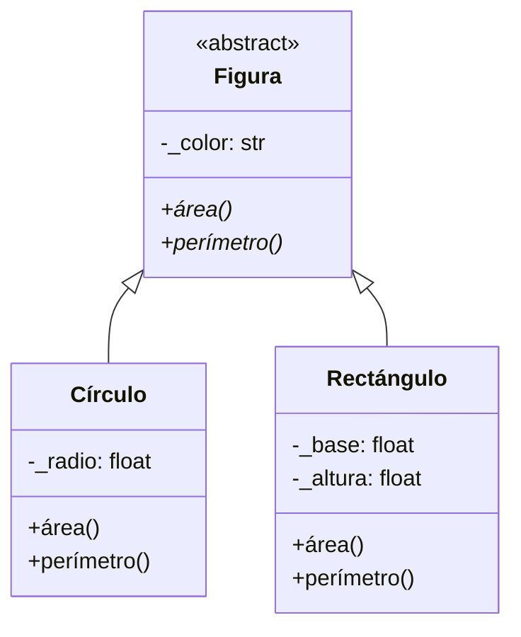

# Laboratorio 4.1 – Áreas y perímetros

## Objetivo de la práctica:
Al finalizar la práctica, serás capaz de:
- Repasar los conceptos de clases, herencia y clases abstractas.
- Implementar en Python un diagrama de clases UML, respetando su jerarquía y visibilidad de atributos.
- Comprender por qué los nombres de los métodos abstractos deben coincidir exactamente con los de sus sobreescrituras en las subclases.

## Objetivo Visual



> El asterisco (`*`) junto a `área()` y `perímetro()` en `Figura` indica que son **métodos abstractos**: `Figura` declara que toda figura debe poder calcular su área y su perímetro, pero no sabe **cómo** hacerlo — esa responsabilidad la delega a cada subclase concreta.

## Duración aproximada:
- 15 minutos.

## Tabla de ayuda:
| Herramienta | Versión / Detalle | Notas |
| --- | --- | --- |
| Python | 3.10 o superior | Incluye el módulo `abc` en su biblioteca estándar |
| Visual Studio Code | Última versión estable | |
| Carpeta de trabajo | `ws_curso` | |
| Módulo a crear | `p4_1.py` | El enunciado menciona `p4_1.py`, pero el código de prueba importa `from p7_1 import ...`; se usa `p4_1.py` para mantener consistencia con el resto del capítulo (`p4_2.py`, `p4_3.py`, etc.) |
| Archivo de prueba | `Test.py` | |

## Instrucciones

### Tarea 1. Crear la clase abstracta `Figura`
Paso 1. En la carpeta `ws_curso`, crear un archivo de nombre `p4_1.py`.

Paso 2. Importar las herramientas necesarias para declarar clases abstractas en Python: la clase `ABC` y el decorador `abstractmethod`, ambos del módulo `abc`.

```python
from abc import ABC, abstractmethod
import math
```

> **¿Qué es `ABC`?** Es la clase base (*Abstract Base Class*) que Python provee para crear clases abstractas. Al heredar de `ABC`, una clase no podrá instanciarse directamente si le quedan métodos marcados como abstractos sin implementar — así es como Python impone en tiempo de ejecución la restricción `«abstract»` que ves en el diagrama UML.

Paso 3. Definir la clase `Figura`, heredando de `ABC`, con el atributo `_color` y los dos métodos abstractos del diagrama.

```python
class Figura(ABC):
    def __init__(self, color="Sin definir"):
        self._color = color

    @abstractmethod
    def área(self):
        pass

    @abstractmethod
    def perímetro(self):
        pass
```

> **¿Por qué `_color` lleva un guion bajo al inicio?** El símbolo `-` en el diagrama UML indica visibilidad **privada**. Python no tiene atributos verdaderamente privados, pero la convención ampliamente aceptada es anteponer un guion bajo (`_color`) para señalar "este atributo es de uso interno de la clase; no lo modifiques directamente desde fuera".
>
> **¿Por qué el constructor recibe `color` con un valor por defecto?** El código de prueba que usarás más adelante crea las figuras sin especificar un color (por ejemplo, `Círculo(10)`), así que un valor por defecto evita tener que modificar ese código, y aun así deja abierta la posibilidad de indicar un color si se desea.
>
> **¿Qué hace `@abstractmethod`?** Marca un método como **obligatorio de implementar** en cualquier subclase concreta. Si una subclase de `Figura` no define `área()` **con ese nombre exacto**, Python no permitirá crear instancias de esa subclase y lanzará un `TypeError` al intentarlo.

### Tarea 2. Crear las subclases `Círculo` y `Rectángulo`
Paso 1. En el mismo archivo `p4_1.py`, definir la clase `Círculo`, heredando de `Figura`.

```python
class Círculo(Figura):
    def __init__(self, radio, color="Sin definir"):
        super().__init__(color)
        self._radio = radio

    def área(self):
        return math.pi * self._radio ** 2

    def perímetro(self):
        return 2 * math.pi * self._radio

    def __str__(self):
        return f"Círculo(radio={self._radio})"
```

> **¿Qué hace `super().__init__(color)`?** Invoca el constructor de la clase padre (`Figura`), para que se encargue de inicializar el atributo `_color` heredado, antes de que `Círculo` agregue su propio atributo `_radio`. Es la forma correcta de reutilizar la lógica de inicialización de la clase base en lugar de duplicarla.
>
> **¿Por qué se agrega `__str__`?** El diagrama UML no lo incluye, pero el código de prueba de la Tarea 3 imprime directamente el objeto (`print(f, ...)`). Sin un método `__str__`, Python mostraría algo como `<p4_1.Círculo object at 0x...>`, poco útil para verificar el resultado. Definir `__str__` permite controlar cómo se representa el objeto como texto.
>
> **Fórmulas utilizadas:** el área de un círculo es `π · radio²` y su perímetro (circunferencia) es `2 · π · radio`. El módulo `math` provee la constante `math.pi` con suficiente precisión para estos cálculos.

Paso 2. Definir la clase `Rectángulo`, heredando de `Figura`.

```python
class Rectángulo(Figura):
    def __init__(self, base, altura, color="Sin definir"):
        super().__init__(color)
        self._base = base
        self._altura = altura

    def área(self):
        return self._base * self._altura

    def perímetro(self):
        return 2 * (self._base + self._altura)

    def __str__(self):
        return f"Rectángulo(base={self._base}, altura={self._altura})"
```

> **¿Por qué `_base` y `_altura` llevan guion bajo?** Aunque a primera vista el diagrama podría leerse como atributos públicos, el símbolo `-` que los precede en el diagrama UML original indica visibilidad **privada**, igual que `_radio` en `Círculo` — por eso se nombran con el mismo criterio de guion bajo.
>
> 💡 **Buena práctica — nombres de métodos idénticos entre superclase y subclase:** fíjate que tanto `Círculo` como `Rectángulo` implementan métodos llamados **exactamente** `área()` y `perímetro()`, igual que los abstractos declarados en `Figura`. Esto no es casualidad: si una subclase implementara, por ejemplo, un método llamado `area()` (sin tilde) en lugar de `área()`, Python seguiría considerando que el método abstracto `área()` de `Figura` **no fue implementado**, y no permitiría crear instancias de esa subclase — recibirías un `TypeError` al intentar `Círculo(10)`.

### Tarea 3. Crear el programa de prueba
Paso 1. En la carpeta `ws_curso` (al mismo nivel que `p4_1.py`), crear un archivo de nombre `Test.py`.

Paso 2. Capturar el código de prueba proporcionado, importando las tres clases desde el módulo `p4_1`.

```python
from p7_1 import Figura, Círculo, Rectángulo

figuras = [Círculo(10), Círculo(1), Rectángulo(1, 1), Rectángulo(2, 2)]

for f in figuras:
    print(f, f.área(), f.perímetro())
```

> **¿Qué hace este código?** Crea una lista con cuatro instancias de figuras concretas (dos círculos, dos rectángulos) y, mediante un ciclo `for`, invoca `área()` y `perímetro()` sobre cada una — sin que el código necesite saber de qué tipo específico es cada figura. Esto es **polimorfismo**: el mismo código (`f.área()`) produce un resultado distinto según el tipo real del objeto `f`.

Paso 3. Ejecutar `Test.py` desde la terminal.

```bash
python Test.py
```

### Tarea 4. Reflexionar sobre el rol de la clase abstracta
Paso 1. Intentar, desde el REPL de Python, crear una instancia directa de `Figura`.

```python
>>> from p4_1 import Figura
>>> Figura()
```

> **Resultado esperado:**
> ```
> TypeError: Can't instantiate abstract class Figura with abstract methods área, perímetro
> ```
> **Explicación:** `Figura` cumple su propósito de diagrama UML `«abstract»` — sirve como plantilla común para `Círculo` y `Rectángulo`, pero nunca debe instanciarse por sí misma, ya que no tiene forma de calcular un área o un perímetro sin saber de qué figura se trata.

### Resultado esperado
Al ejecutar `Test.py`, la consola debe mostrar:

```
Círculo(radio=10) 314.1592653589793 62.83185307179586
Círculo(radio=1) 3.141592653589793 6.283185307179586
Rectángulo(base=1, altura=1) 1 4
Rectángulo(base=2, altura=2) 4 8
```

> Nota: los rectángulos muestran valores enteros (`1`, `4`, `8`) porque `Rectángulo(1, 1)` y `Rectángulo(2, 2)` reciben números enteros como `base` y `altura`, y las operaciones entre enteros en Python producen enteros. Si en cambio invocaras `Rectángulo(1.0, 1.0)`, el resultado se mostraría como `1.0`.
