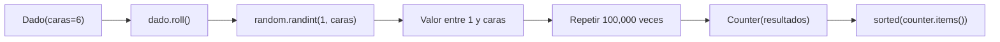

# Laboratorio 4.2 – Dados

## Objetivo de la práctica:
Al finalizar la práctica, serás capaz de:
- Reafirmar los conceptos de la Programación Orientada a Objetos (POO) empleando Python.
- Completar una clase existente agregándole un nuevo método.
- Utilizar el módulo `random` para generar valores aleatorios, y `collections.Counter` para tabular resultados.

## Objetivo Visual


## Duración aproximada:
- 15 minutos.

## Tabla de ayuda:
| Herramienta | Versión / Detalle | Notas |
| --- | --- | --- |
| Python | 3.10 o superior | Incluye `random` y `collections` en su biblioteca estándar |
| Visual Studio Code | Última versión estable | |
| Carpeta de trabajo | `ws_curso` | |
| Módulo a crear | `p4_2.py` | |
| Comandos útiles | `help(random.randint)`, `dir(random)` | Consulta la documentación y el contenido de un módulo directamente desde el REPL |

## Instrucciones

### Tarea 1. Completar el método `roll()` de la clase `Dado`
Paso 1. En la carpeta `ws_curso`, crear un archivo de nombre `p7_2.py` y capturar el código inicial proporcionado.

```python
import random

class Dado:
    def __init__(self, caras=6):
        self.caras = caras

    # Agrega el método roll
```

Paso 2. Reemplazar el comentario con la definición del método `roll()`, que devuelva un número entero aleatorio entre `1` y el número de caras del dado.

```python
import random

class Dado:
    def __init__(self, caras=6):
        self.caras = caras

    def roll(self):
        return random.randint(1, self.caras)
```

> **¿Qué hace `random.randint(1, self.caras)`?** Devuelve un número entero aleatorio dentro del rango indicado, **incluyendo ambos extremos**. Es decir, para un dado de 6 caras (`self.caras = 6`), puede devolver cualquier valor entero entre `1` y `6`, ambos inclusive — a diferencia de `range()`, que excluye su límite superior.
>
> **¿Por qué se usa `self.caras` y no un número fijo como `6`?** Porque la clase `Dado` fue diseñada para representar dados de **cualquier** número de caras (el parámetro `caras` del constructor tiene un valor por defecto de `6`, pero acepta otros valores). Usar `self.caras` hace que `roll()` funcione correctamente sin importar con cuántas caras se haya creado el dado.

### Tarea 2. Probar la solución manualmente
Paso 1. Desde el REPL de Python (o un script de prueba), crear una instancia de `Dado` e invocar `roll()` varias veces.

```python
>>> from p4_2 import Dado
>>> d = Dado()
>>> d.roll()
>>> d.roll()
>>> d.roll()
```

> **Resultado esperado:** cada llamada a `d.roll()` debe devolver un número entero entre `1` y `6` (ya que `Dado()` usa el valor por defecto `caras=6`). Al ser aleatorio, es normal —y esperado— obtener valores distintos, incluso repetidos, en llamadas consecutivas.

### Tarea 3. (Opcional) Tirar el dado 100,000 veces y tabular los resultados
Paso 1. En un nuevo bloque de código (o en el mismo REPL), generar una lista con los resultados de tirar el dado 100,000 veces.

```python
resultados = [d.roll() for _ in range(100_000)]
```

> **¿Qué hace esta línea?** Es una **comprensión de lista** (*list comprehension*): construye una lista ejecutando `d.roll()` una vez por cada iteración del `range(100_000)`. El guion bajo `_` como nombre de variable es una convención para indicar "esta variable del ciclo no se usa dentro del cuerpo", ya que solo nos interesa repetir la acción, no el valor del contador.

Paso 2. Importar `Counter` desde el módulo `collections` y usarlo para contar cuántas veces cayó el dado en cada valor.

```python
from collections import Counter

conteo = Counter(resultados)
```

> **¿Qué hace `Counter`?** Es una subclase especializada de diccionario que, al recibir una lista, cuenta automáticamente cuántas veces aparece cada elemento distinto. El resultado es similar a un diccionario `{1: cantidad, 2: cantidad, ...}`, pero con métodos adicionales útiles para análisis de frecuencias.

Paso 3. Mostrar el resultado ordenado por el valor de la cara del dado, usando la función preconstruida `sorted()`.

```python
print(sorted(conteo.items()))
```

> **¿Qué hace `conteo.items()`?** Devuelve pares `(cara, cantidad)` a partir del `Counter`, en el orden en que fueron registrados internamente (que no necesariamente es el orden numérico de las caras).
>
> **¿Por qué se envuelve con `sorted()`?** `Counter` no garantiza que sus elementos queden ordenados por el valor de la cara del dado. `sorted()` reordena la lista de pares `(cara, cantidad)` de menor a mayor según el primer elemento de cada par (la cara), produciendo una salida más fácil de leer.
>
> 💡 **Buena práctica:** cuando no recuerdes con exactitud qué hace una función o clase (por ejemplo `Counter` o `randint`), usa `help(random.randint)` o `dir(random)` directamente desde el REPL para consultar su documentación o explorar los elementos disponibles en un módulo, sin salir de tu sesión de trabajo.

### Resultado esperado
Cada ejecución producirá números ligeramente distintos, ya que el resultado depende de valores aleatorios. Sin embargo, con 100,000 lanzamientos de un dado de 6 caras, se espera una distribución aproximadamente uniforme, cercana a `100,000 / 6 ≈ 16,667` por cara, similar a:

```
[(1, 16422), (2, 16596), (3, 16567), (4, 16761), (5, 16951), (6, 16703)]
```

> Nota: tus números exactos **no** coincidirán con los de arriba —eso es esperado, dado que cada ejecución genera una secuencia aleatoria distinta—, pero deben ser razonablemente parecidos entre sí (ninguna cara debería aparecer muchas más veces que las demás).
