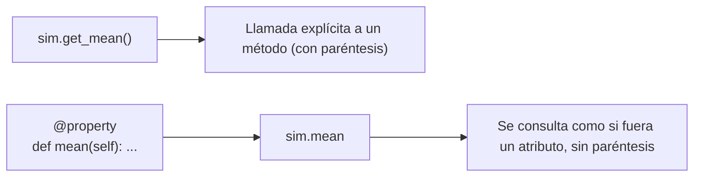

# Laboratorio 4.3 – Propiedades

## Objetivo de la práctica:
Al finalizar la práctica, serás capaz de:
- Repasar cómo definir propiedades de un objeto en Python.
- Convertir métodos `get_*` en propiedades usando el decorador `@property`.
- Comprender la diferencia práctica, desde el punto de vista de quien usa una clase, entre invocar un método y consultar una propiedad.

## Objetivo Visual


## Duración aproximada:
- 20 minutos.

## Tabla de ayuda:
| Herramienta | Versión / Detalle | Notas |
| --- | --- | --- |
| Python | 3.10 o superior | Incluye el módulo `statistics` en su biblioteca estándar |
| Visual Studio Code | Última versión estable | |
| Carpeta de trabajo | `ws_curso` | |
| Módulo a crear | `p4_3.py` | |
| Requisito previo | Clase `Dado` con el método `roll()` de la práctica 4.2 | Debe existir en `p4_2.py`, en la misma carpeta |

## Instrucciones

### Tarea 1. Crear la clase `Simulation` con métodos `get_*`
Paso 1. En la carpeta `ws_curso`, crear un archivo de nombre `p4_3.py` y capturar el código proporcionado.

```python
import statistics as stats

class Simulation:
    def __init__(self, fnct_to_run, iterations):
        self._fnct_to_run = fnct_to_run
        self._iterations = iterations
        self._results = []
        self.run()

    def run(self):
        for i in range(self._iterations):
            result = self._fnct_to_run()
            self._results.append(result)

    def get_mean(self):
        return stats.mean(self._results)

    def get_median(self):
        return stats.median(self._results)

    def get_mode(self):
        try:
            return stats.mode(self._results)
        except:
            return None
```

> **¿Qué hace la clase `Simulation`?** Recibe una función (`fnct_to_run`) y un número de iteraciones. En su constructor, llama a `self.run()`, que ejecuta esa función repetidamente (por ejemplo, `dado.roll`) y guarda cada resultado en la lista `self._results`. Una vez recolectados todos los resultados, los métodos `get_mean()`, `get_median()` y `get_mode()` calculan el promedio, la mediana y la moda usando el módulo `statistics`.
>
> **¿Por qué se recibe `fnct_to_run` como parámetro en lugar de una lista de resultados ya calculada?** Esto permite que `Simulation` sea reutilizable con **cualquier** función que no reciba argumentos y devuelva un valor —no solo con `dado.roll`—, ya que la clase no necesita saber nada sobre qué hace esa función, solo que puede invocarse repetidamente.
>
> **¿Por qué `get_mode()` usa `try/except`?** La moda solo está definida cuando existe un valor que se repite más que los demás; en ciertas circunstancias, el cálculo de la moda puede fallar si no hay un resultado claramente predominante. El bloque `try/except` evita que el programa se detenga por completo ante ese caso, devolviendo `None` en su lugar.
>
> 💡 **Buena práctica:** el `except:` sin especificar un tipo de excepción (llamado *bare except*) captura **cualquier** error, no solo el esperado — esto puede ocultar errores de programación genuinos que nada tienen que ver con el cálculo de la moda. Una versión más precisa sería `except statistics.StatisticsError:`, que solo intercepta el error específico que `stats.mode()` puede lanzar. Se conserva el `except:` genérico aquí por fidelidad al código proporcionado en el curso, pero es una mejora recomendable para código de producción.

### Tarea 2. Probar la clase con los métodos `get_*`
Paso 1. Asegúrate de contar con el archivo `p4_2.py` de la práctica 4.2 (con la clase `Dado` y su método `roll()`) en la misma carpeta.

Paso 2. Desde el REPL de Python, ejecutar la siguiente secuencia:

```python
>>> from p4_2 import Dado
>>> from p4_3 import Simulation
>>> d = Dado()
>>> sim = Simulation(d.roll, 1000)
>>> print(sim.get_mean(), sim.get_median(), sim.get_mode())
```

> **¿Qué hace `Simulation(d.roll, 1000)`?** Crea una simulación que llamará a `d.roll` (nota que se pasa **sin paréntesis**: se está pasando la función misma como valor, no el resultado de invocarla) exactamente 1000 veces, guardando cada resultado.
>
> **Resultado esperado (los valores exactos variarán, por tratarse de resultados aleatorios):**
> ```
> 3.583 4.0 5
> ```
> Es decir: el promedio de 1000 lanzamientos ronda el valor esperado de un dado de 6 caras (`3.5`), la mediana es `4.0`, y la moda (el valor más frecuente) fue `5` en esa ejecución particular.

### Tarea 3. Convertir los métodos `get_*` en propiedades
Paso 1. Modificar `p4_3.py`, renombrando cada método `get_*` (quitando el prefijo `get_`) y anteponiendo el decorador `@property`.

```python
import statistics as stats

class Simulation:
    def __init__(self, fnct_to_run, iterations):
        self._fnct_to_run = fnct_to_run
        self._iterations = iterations
        self._results = []
        self.run()

    def run(self):
        for i in range(self._iterations):
            result = self._fnct_to_run()
            self._results.append(result)

    @property
    def mean(self):
        return stats.mean(self._results)

    @property
    def median(self):
        return stats.median(self._results)

    @property
    def mode(self):
        try:
            return stats.mode(self._results)
        except:
            return None
```

> **¿Qué hace `@property`?** Convierte un método en algo que se **consulta como si fuera un atributo**, sin necesidad de escribir paréntesis al llamarlo. Internamente, el método sigue ejecutándose por completo cada vez que se accede a la propiedad (calculando el promedio nuevamente, en este caso), pero desde el punto de vista de quien usa la clase, la sintaxis se ve idéntica a la de consultar un atributo simple como `sim._results`.
>
> **¿Por qué usar una propiedad en lugar de un método `get_*`?** Es una convención muy extendida en Python: cuando obtener un valor no requiere argumentos y no tiene efectos secundarios relevantes (como aquí, donde solo se calcula una estadística a partir de datos ya existentes), se prefiere exponerlo como propiedad. Esto hace que el código que usa la clase (`sim.mean`) se lea de forma más natural que `sim.get_mean()`, sin perder la capacidad de que el valor se recalcule dinámicamente en cada consulta.

### Tarea 4. Probar la clase con las nuevas propiedades
Paso 1. Ejecutar la misma secuencia de prueba, pero accediendo a `mean`, `median` y `mode` como propiedades — **sin paréntesis**.

```python
>>> from p4_2 import Dado
>>> from p4_3 import Simulation
>>> d = Dado()
>>> sim = Simulation(d.roll, 1000)
>>> print(sim.mean, sim.median, sim.mode)
```

> ⚠️ **Error común:** si escribieras `sim.mean()` (con paréntesis) después de convertir `mean` en una propiedad, obtendrías un error, ya que `sim.mean` **ya es** el valor numérico calculado (un `float`), no una función que se pueda invocar — intentar "llamar" a un número con `()` produce `TypeError: 'float' object is not callable`.
>
> **Resultado esperado (los valores exactos variarán, por tratarse de resultados aleatorios):**
> ```
> 3.545 4.0 6
> ```

### Resultado esperado
Ambas versiones de `Simulation` (con métodos `get_*` y con propiedades) deben producir el mismo tipo de resultado —promedio, mediana y moda de los lanzamientos—, pero con una sintaxis de consulta distinta:

| Versión | Sintaxis de consulta | Ejemplo de salida |
| --- | --- | --- |
| Métodos `get_*` | `sim.get_mean()`, `sim.get_median()`, `sim.get_mode()` | `3.583 4.0 5` |
| Propiedades | `sim.mean`, `sim.median`, `sim.mode` | `3.545 4.0 6` |

> Nota: los valores numéricos difieren entre ambas ejecuciones porque cada una generó su propia secuencia aleatoria de 1000 lanzamientos — lo importante a verificar es que la **sintaxis** de propiedades funciona sin paréntesis y produce resultados del mismo tipo (promedio, mediana, moda) que la versión original.