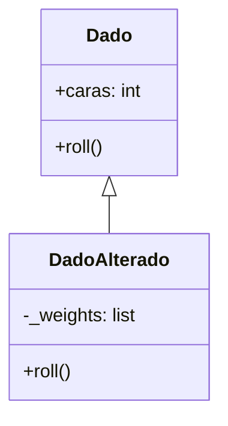

# Laboratorio 4.4 – Dados alterados

## Objetivo de la práctica:
Al finalizar la práctica, serás capaz de:
- Reafirmar el uso de conceptos de POO como la herencia y la sobreescritura de métodos.
- Construir una subclase que modifica el comportamiento de su clase padre para simular un dado con probabilidades desiguales entre caras.

Nota: esta práctica es **opcional** para realizarse en clase.

## Objetivo Visual


## Duración aproximada:
- 15 minutos (opcional).

## Tabla de ayuda:
| Herramienta | Versión / Detalle | Notas |
| --- | --- | --- |
| Python | 3.10 o superior | |
| Visual Studio Code | Última versión estable | |
| Carpeta de trabajo | `ws_curso` | |
| Módulo a crear | `p4_4.py` | |
| Requisito previo | Clase `Dado` de la práctica 4.2 | Debe existir en `p4_2.py`, en la misma carpeta |

## Instrucciones

### Tarea 1. Analizar el código proporcionado
Paso 1. En la carpeta `ws_curso`, crear un archivo de nombre `p4_4.py` y capturar el código inicial.

```python
import random
from collections import Counter
from p4_2 import Dado


class DadoAlterado(Dado):

    def __init__(self, weights, sides=6):
        if len(weights) != sides:
            raise Exception('Los pesos deben ser del mismo tamaño que el dado de {} caras.'.format(sides))
        super().__init__(sides)
        self._weights = weights

    def roll(self):
        """Devuelve un valor entre 1 y el número de lados del dado."""

        # Su código debe ir aquí
```

> **¿Qué hace `class DadoAlterado(Dado):`?** Declara que `DadoAlterado` **hereda** de `Dado`: automáticamente obtiene todo lo que `Dado` ya sabe hacer (como almacenar el número de caras), y puede además agregar o **sobreescribir** comportamiento propio — en este caso, un `roll()` distinto que toma en cuenta pesos por cada cara.
>
> **¿Qué hace `super().__init__(sides)`?** Invoca el constructor de `Dado` (la clase padre), pasándole `sides` como el número de caras. Esto reutiliza la lógica ya existente en `Dado.__init__()` en lugar de duplicarla, y asegura que `DadoAlterado` quede correctamente inicializado como un `Dado` válido antes de agregar su propio atributo `_weights`.
>
> **¿Qué valida el `if len(weights) != sides:`?** Antes de continuar, se asegura de que la lista de pesos tenga exactamente un peso por cada cara del dado. Si no coinciden, se lanza una excepción con un mensaje descriptivo, evitando que el objeto quede en un estado inconsistente (por ejemplo, un dado de 6 caras con solo 4 pesos definidos).

Paso 2. Observar que `self._weights` almacena una lista de pesos, uno por cada cara. Por ejemplo, para un dado de 6 caras con los pesos `[1, 1, 1, 1, 1, 5]`, la cara `6` tiene cinco veces más probabilidad de salir que cualquiera de las otras.

### Tarea 2. Completar el método `roll()`
Paso 1. Implementar `roll()` construyendo una lista expandida, donde cada cara aparece repetida tantas veces como indique su peso.

```python
    def roll(self):
        """Devuelve un valor entre 1 y el número de lados del dado."""
        posibles_valores = []
        for cara, peso in enumerate(self._weights, start=1):
            posibles_valores.extend([cara] * peso)
        return random.choice(posibles_valores)
```

> **¿Qué hace `enumerate(self._weights, start=1)`?** Recorre la lista `self._weights` devolviendo pares `(índice, valor)`, pero iniciando el índice en `1` en lugar de `0` (su comportamiento por defecto). Esto es útil aquí porque las caras de un dado se numeran a partir de `1`, mientras que las posiciones de una lista en Python comienzan en `0` — `start=1` alinea ambos sistemas de numeración.
>
> **¿Qué hace `posibles_valores.extend([cara] * peso)`?** `[cara] * peso` crea una lista con el número `cara` repetido `peso` veces (por ejemplo, `[6] * 5` produce `[6, 6, 6, 6, 6]`). `extend()` agrega todos esos elementos al final de `posibles_valores`, en lugar de agregar la lista completa como un solo elemento (que es lo que haría `append()`).
>
> **¿Por qué este truco simula pesos de forma correcta?** Con los pesos `[1, 1, 1, 1, 1, 5]`, `posibles_valores` termina siendo `[1, 2, 3, 4, 5, 6, 6, 6, 6, 6]` — una lista de 10 elementos donde `6` aparece 5 veces y el resto solo una vez. Al usar `random.choice()` (que elige un elemento al azar con **igual probabilidad** para cada elemento de la lista), la cara `6` termina teniendo 5 de cada 10 posibilidades de ser elegida (50%), mientras que cada una de las demás caras tiene solo 1 de cada 10 (10%) — exactamente la proporción que indican los pesos originales.

### Tarea 3. Probar la solución
Paso 1. Desde el REPL, crear un `DadoAlterado` con los pesos de ejemplo y tirarlo 100,000 veces, tabulando el resultado igual que en la práctica 4.2.

```python
>>> from p4_4 import DadoAlterado
>>> from collections import Counter
>>> dado_alterado = DadoAlterado([1, 1, 1, 1, 1, 5])
>>> resultados = [dado_alterado.roll() for _ in range(100_000)]
>>> print(sorted(Counter(resultados).items()))
```

> **Resultado esperado (los valores exactos variarán por ser aleatorios):**
> ```
> [(1, 9899), (2, 10012), (3, 10083), (4, 10133), (5, 10011), (6, 49869)]
> ```
> **Verificación:** la suma de los pesos es `1+1+1+1+1+5 = 10`. Cada cara con peso `1` debería representar aproximadamente `1/10 = 10%` de los lanzamientos (~10,000 de 100,000), y la cara `6`, con peso `5`, aproximadamente `5/10 = 50%` (~50,000) — proporciones que coinciden con el resultado obtenido.

### Tarea 4. Nota sobre la propiedad `rolls`
El enunciado original de esta práctica menciona que una instancia de `DadoAlterado` "hereda una propiedad `rolls` de la clase `Dado`". Sin embargo, la clase `Dado` tal como se construyó en la práctica 4.2 **no incluye** dicha propiedad (solo agrega el método `roll()`, sin registrar cuántas veces se ha lanzado el dado).

> 💡 **Ejercicio adicional (opcional):** si quieres que esta nota sea coherente, puedes extender la clase `Dado` de la práctica 4.2 agregando un contador interno y exponiéndolo como propiedad, por ejemplo:
> ```python
> class Dado:
>     def __init__(self, caras=6):
>         self.caras = caras
>         self._rolls = 0
>
>     def roll(self):
>         self._rolls += 1
>         return random.randint(1, self.caras)
>
>     @property
>     def rolls(self):
>         return self._rolls
> ```
> Con este cambio, `DadoAlterado` heredaría automáticamente la propiedad `rolls`, mostrando cuántas veces se ha lanzado el dado, sin necesidad de modificar `DadoAlterado` en absoluto — otro ejemplo de cómo la herencia permite reutilizar comportamiento de la clase padre.

### Resultado esperado
Con los pesos `[1, 1, 1, 1, 1, 5]` y 100,000 lanzamientos, la cara `6` debe aparecer aproximadamente 5 veces más que cualquiera de las otras cinco caras, cada una de estas últimas con una frecuencia similar entre sí:

```
[(1, 9899), (2, 10012), (3, 10083), (4, 10133), (5, 10011), (6, 49869)]
```
