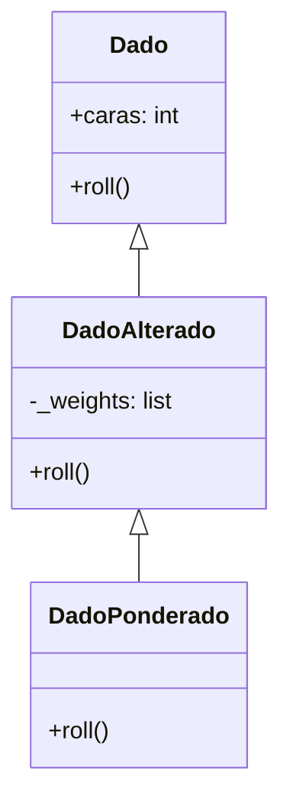

# Laboratorio 4.5 – Dado ponderado

## Objetivo de la práctica:
Al finalizar la práctica, serás capaz de:
- Reforzar conceptos generales de la Programación Orientada a Objetos.
- Construir una segunda capa de herencia (`DadoPonderado` extiende `DadoAlterado`, que a su vez extiende `Dado`).
- Implementar un dado que modifica sus propios pesos dinámicamente en función de resultados anteriores.

Nota: esta práctica es **opcional**.

## Objetivo Visual


## Duración aproximada:
- 15 minutos

## Tabla de ayuda:
| Herramienta | Versión / Detalle | Notas |
| --- | --- | --- |
| Python | 3.10 o superior | |
| Visual Studio Code | Última versión estable | |
| Carpeta de trabajo | `ws_curso` | |
| Módulo a crear | `p4_5.py` | |
| Requisito previo | Clase `DadoAlterado` de la práctica 4.4 | Debe existir en `p4_4.py`, en la misma carpeta |

## Instrucciones

### Tarea 1. Analizar el constructor de `DadoPonderado`
Paso 1. En la carpeta `ws_curso`, crear un archivo de nombre `p4_5.py` y capturar el código inicial.

```python
import random
from collections import Counter
from p4_4 import DadoAlterado


class DadoPonderado(DadoAlterado):
    def __init__(self, sides=6):
        self._weights = [1] * sides
        super().__init__(self._weights, sides)

    def roll(self):
        pass  # Su código
```

> **¿Qué hace `class DadoPonderado(DadoAlterado):`?** Extiende `DadoAlterado`, heredando por transitividad también de `Dado` (`Dado` → `DadoAlterado` → `DadoPonderado`). Esto significa que `DadoPonderado` ya cuenta con el mecanismo de "lista expandida de posibles valores" que construiste en la práctica 4.4, y solo necesita ajustar cómo cambian los pesos a lo largo del tiempo.
>
> **¿Qué hace `self._weights = [1] * sides`?** Crea una lista con `sides` elementos, todos con el valor `1` (por ejemplo, `[1] * 6` produce `[1, 1, 1, 1, 1, 1]`). A diferencia de `DadoAlterado`, que recibe pesos personalizados como argumento, `DadoPonderado` siempre **comienza** con pesos iguales para todas las caras, y son los propios lanzamientos los que, con el tiempo, van desequilibrando esos pesos.
>
> **¿Por qué se llama a `super().__init__(self._weights, sides)`?** Reutiliza el constructor de `DadoAlterado`, que ya sabe validar que la cantidad de pesos coincida con el número de caras y almacenar `_weights` y `caras` correctamente — evitando repetir esa lógica en `DadoPonderado`.

### Tarea 2. Completar el método `roll()`
Paso 1. Implementar `roll()` siguiendo tres pasos: lanzar el dado usando el comportamiento heredado, incrementar el peso de la cara obtenida, y devolver el resultado.

```python
    def roll(self):
        resultado = super().roll()
        self._weights[resultado - 1] += 1
        return resultado
```

> **¿Qué hace `super().roll()`?** Invoca el método `roll()` de la clase padre (`DadoAlterado`), que ya sabe construir la lista expandida de posibles valores a partir de `self._weights` actuales y elegir uno al azar con `random.choice()`. `DadoPonderado` no reimplementa esa lógica: la **reutiliza**.
>
> **¿Qué hace `self._weights[resultado - 1] += 1`?** Incrementa en `1` el peso correspondiente a la cara que acaba de salir. Se resta `1` al `resultado` porque las caras se numeran desde `1`, mientras que los índices de una lista en Python comienzan en `0` — la cara `1` corresponde al índice `0` de `_weights`, la cara `2` al índice `1`, y así sucesivamente.
>
> **¿Qué efecto tiene esto con el paso del tiempo?** Cada vez que una cara sale, su peso aumenta, lo que la hace **ligeramente más probable** de volver a salir en el siguiente lanzamiento. Este tipo de dinámica —donde "lo que ya ocurrió tiende a repetirse cada vez más"— se conoce como **retroalimentación positiva** o, en términos de probabilidad, un modelo similar a una "urna de Pólya": pequeñas ventajas iniciales tienden a amplificarse con el tiempo, en lugar de diluirse.

### Tarea 3. Probar la solución
Paso 1. Desde el REPL, crear una instancia de `DadoPonderado` y lanzarla varias veces, tabulando el resultado.

```python
>>> from p4_5 import DadoPonderado
>>> from collections import Counter
>>> dado_ponderado = DadoPonderado()
>>> resultados = [dado_ponderado.roll() for _ in range(1000)]
>>> print(sorted(Counter(resultados).items()))
```

> **Resultado esperado (variará considerablemente entre ejecuciones):**
> ```
> [(1, 40), (2, 117), (3, 129), (4, 578), (5, 108), (6, 28)]
> ```
> **Explicación del resultado:** a diferencia de la práctica 4.4 (donde los pesos eran fijos desde el inicio y por tanto la proporción final era predecible), aquí los pesos **cambian dinámicamente** conforme se realizan los lanzamientos. Cuál cara terminará "ganando" es impredecible de antemano — en esta ejecución de ejemplo fue la cara `4` la que acumuló más peso (con 578 de 1000 lanzamientos), simplemente porque tuvo una ligera ventaja temprana que la retroalimentación positiva fue amplificando. En otra ejecución, con otra secuencia aleatoria inicial, podría haber sido cualquier otra cara.

### Resultado esperado
Al ejecutar 1000 lanzamientos de un `DadoPonderado`, una de las seis caras terminará acumulando visiblemente más lanzamientos que las demás (no necesariamente la misma cara en cada ejecución), como en el ejemplo:

```
[(1, 40), (2, 117), (3, 129), (4, 578), (5, 108), (6, 28)]
```

> Si ejecutas la prueba varias veces, es un buen ejercicio observar que la cara "ganadora" cambia de una ejecución a otra — evidencia de que el resultado depende sensiblemente de los primeros lanzamientos aleatorios, no de una preferencia fija hacia alguna cara en particular.
