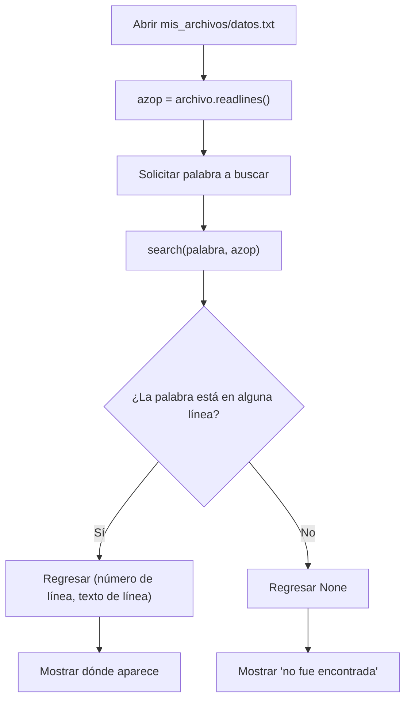

# Laboratorio 5.1 – Encontrar texto en un archivo

## Objetivo de la práctica:
Al finalizar la práctica, serás capaz de:
- Repasar lo visto en el capítulo referente a la gestión de archivos.
- Crear un programa para buscar texto dentro de un archivo dado.
- Utilizar `enumerate()` para asociar cada línea de un archivo con su número de línea.

## Objetivo Visual


## Duración aproximada:
- 15 minutos.

## Tabla de ayuda:
| Herramienta | Versión / Detalle | Notas |
| --- | --- | --- |
| Python | 3.10 o superior | |
| Visual Studio Code | Última versión estable | |
| Carpeta de trabajo | `ws_curso` | |
| Archivo a crear | `p5_1.py` | |
| Archivo de datos | `mis_archivos/datos.txt` | Ver Tarea 1 — no se incluyó en el material, así que se propone un contenido de ejemplo |

## Instrucciones

### Tarea 1. Preparar el archivo de datos
Paso 1. Dentro de `ws_curso`, crear una carpeta de nombre `mis_archivos`.

Paso 2. Dentro de `mis_archivos`, crear un archivo de texto de nombre `datos.txt`. 

```
La guerra de las galaxias sucede hace mucho tiempo.
En una galaxia muy, muy lejana.
Los Jedi protegen la paz usando la fuerza.
El lado oscuro tienta a quienes buscan poder.
Darth Vader fue alguna vez un Jedi llamado Anakin.
La fuerza acompaña a quienes la escuchan.
```

### Tarea 2. Completar la función `main()`
Paso 1. En `ws_curso`, crear el archivo `p5_1.py` y capturar el esqueleto de código proporcionado.

```python
# Práctica 5.1 Encontrar texto en un archivo

def search(word, text):
    """Regresa una tupla con el número de línea y la línea de texto (o nada)"""
    pass

def main():

    # Abre el archivo mis_archivos/datos.txt
    # Crea una lista con el contenido del archivo.
    # Guarda la lista con el nombre de azop.

    palabra = input('Ingrese una palabra: ')

    result = search(palabra, azop)
    if(result):
        print(palabra, 'aparece en', result[0], ':', result[1])
    else:
        print('La palabra {} no fue encontrada'.format(palabra))

main()
```

Paso 2. Reemplazar los comentarios dentro de `main()`, abriendo el archivo `mis_archivos/datos.txt` y almacenando su contenido, línea por línea, en una lista llamada `azop`.

```python
def main():
    with open('mis_archivos/datos.txt', 'r', encoding='utf-8') as archivo:
        azop = archivo.readlines()

    palabra = input('Ingrese una palabra: ')

    result = search(palabra, azop)
    if(result):
        print(palabra, 'aparece en', result[0], ':', result[1])
    else:
        print('La palabra {} no fue encontrada'.format(palabra))
```

> **¿Qué hace `with open(...) as archivo:`?** Abre el archivo usando un **administrador de contexto**: garantiza que el archivo se cierre automáticamente al salir del bloque `with`, incluso si ocurre un error durante su procesamiento — evitando tener que llamar manualmente a `archivo.close()`.
>
> **¿Qué hace `archivo.readlines()`?** Lee el archivo completo y devuelve una **lista** donde cada elemento es una línea del archivo, incluyendo el carácter de salto de línea (`\n`) al final de cada una (excepto posiblemente la última, si el archivo no termina con un salto de línea).

### Tarea 3. Implementar la función `search()`
Paso 1. Reemplazar el `pass` dentro de `search()` para que recorra la lista de líneas y devuelva una tupla `(número_de_línea, texto_de_línea)` en cuanto encuentre la palabra buscada.

```python
def search(word, text):
    """Regresa una tupla con el número de línea y la línea de texto (o nada)"""
    for numero_linea, linea in enumerate(text, start=1):
        if word in linea:
            return (numero_linea, linea.rstrip('\n'))
    return None
```

> **¿Qué hace `enumerate(text, start=1)`?** Recorre la lista `text` (en este caso, `azop`) devolviendo pares `(índice, elemento)`. El argumento `start=1` hace que la numeración inicie en `1` en lugar de `0`, para que el número de línea reportado coincida con el que vería una persona contando líneas en un editor de texto.
>
> **¿Qué hace `word in linea`?** El operador `in` sobre cadenas de texto comprueba si `word` aparece como **subcadena** dentro de `linea`, sin importar en qué posición. Es una búsqueda sensible a mayúsculas y minúsculas: `"Jedi"` no coincidiría con `"jedi"`.
>
> **¿Por qué se usa `linea.rstrip('\n')`?** Como `readlines()` conserva el salto de línea al final de cada elemento, se elimina explícitamente antes de mostrarlo al usuario, para evitar que el mensaje final quede con un salto de línea "extra" en medio.
>
> **¿Por qué la función devuelve `None` al final?** Si el ciclo `for` recorre **todas** las líneas sin encontrar ninguna coincidencia, la función debe indicar de alguna forma que no hubo resultado. `None` es el valor estándar de Python para representar "ausencia de valor", y es precisamente lo que el `if(result):` de `main()` espera para distinguir entre "se encontró" y "no se encontró".

### Tarea 4. Probar el programa
Paso 1. Ejecutar `p5_1.py` y buscar una palabra que sabes que existe en el archivo, como `"Jedi"`.

```bash
python p5_1.py
```

> **Resultado esperado:**
> ```
> Ingrese una palabra: Jedi
> Jedi aparece en 3 : Los Jedi protegen la paz usando la fuerza.
> ```

Paso 2. Ejecutar nuevamente el programa, buscando una palabra que no existe en el archivo, como `"Yoda"`.

> **Resultado esperado:**
> ```
> Ingrese una palabra: Yoda
> La palabra Yoda no fue encontrada
> ```

### Tarea 5. Modificar el programa para mostrar todas las coincidencias
Paso 1. Notar que, con el contenido de ejemplo, la palabra `"Jedi"` en realidad aparece en **dos** líneas (la 3 y la 5), pero `search()` solo reporta la primera, ya que su `return` termina la función en cuanto encuentra la primera coincidencia.

Paso 2. Crear una nueva función, `search_all()`, que devuelva una **lista** con todas las coincidencias en lugar de detenerse en la primera.

```python
def search_all(word, text):
    """Regresa una lista de tuplas (número de línea, línea de texto) para cada coincidencia."""
    return [
        (numero_linea, linea.rstrip('\n'))
        for numero_linea, linea in enumerate(text, start=1)
        if word in linea
    ]
```

> **¿Qué hace esta comprensión de lista?** Es la versión "de una sola línea" de un ciclo `for` con un `if` dentro, que en lugar de usar `return` para salir en la primera coincidencia, **acumula** todas las tuplas que cumplen la condición `word in linea` en una nueva lista. A diferencia de `search()`, aquí no hay ningún `return` dentro del ciclo, así que se examinan todas las líneas del archivo.

Paso 3. Modificar `main()` para usar `search_all()` en lugar de `search()`, mostrando cada coincidencia encontrada.

```python
def main():
    with open('mis_archivos/datos.txt', 'r', encoding='utf-8') as archivo:
        azop = archivo.readlines()

    palabra = input('Ingrese una palabra: ')

    resultados = search_all(palabra, azop)
    if resultados:
        for numero_linea, texto_linea in resultados:
            print(palabra, 'aparece en', numero_linea, ':', texto_linea)
    else:
        print('La palabra {} no fue encontrada'.format(palabra))
```

### Resultado esperado
Buscando `"Jedi"` con la versión que usa `search_all()`:

```
Ingrese una palabra: Jedi
Jedi aparece en 3 : Los Jedi protegen la paz usando la fuerza.
Jedi aparece en 5 : Darth Vader fue alguna vez un Jedi llamado Anakin.
```
