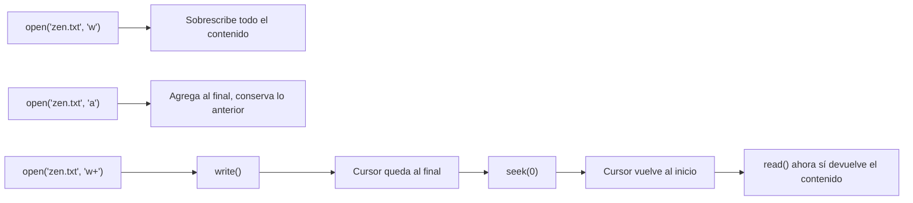

# Laboratorio 5.2 – Escribir en un archivo

## Objetivo de la práctica:
Al finalizar la práctica, serás capaz de:
- Usar los distintos modos de apertura de archivos (`w`, `a`, `w+`) para afectar cómo se lee y escribe en ellos.
- Comprender la posición del cursor dentro de un archivo abierto, y cómo `seek()` la modifica.

## Objetivo Visual


## Duración aproximada:
- 15 minutos.

## Tabla de ayuda:
| Modo | Significado |
| --- | --- |
| `r` | Lectura. Falla si el archivo no existe. |
| `w` | Escritura. Crea el archivo si no existe; si ya existe, **borra su contenido** antes de escribir. |
| `a` | Escritura al final (*append*). Crea el archivo si no existe; si ya existe, escribe **a partir del final**, sin borrar lo anterior. |
| `r+` | Lectura y escritura. El archivo debe existir. |
| `w+` | Lectura y escritura. Igual que `w`, pero además permite leer. |
| `a+` | Lectura y escritura al final. Igual que `a`, pero además permite leer. |

## Instrucciones

### Tarea 1. Escribir en un archivo con el modo `'w'`
Paso 1. Antes de ejecutar nada, verifica si existe el archivo `mis_archivos/zen.txt`. Si existe, elimínalo (puedes usar el explorador de archivos de tu sistema operativo).

Paso 2. En la carpeta `ws_curso`, crear un archivo de nombre `p5_2.py` con el siguiente contenido.

```python
with open('mis_archivos/zen.txt', 'w') as f:
    f.write('La fuerza está contigo.')
```

> Nota: se corrigió "este" por "está" respecto al enunciado original (probablemente un error de captura), ya que la frase hace referencia a la célebre línea de Star Wars "que la fuerza te acompañe".
>
> **¿Qué hace el modo `'w'`?** Abre el archivo para **escritura**. Si `zen.txt` no existe, Python lo crea; si ya existe, su contenido anterior se **descarta por completo** en el momento en que se abre el archivo — no cuando se llama a `write()`, sino desde el propio `open()`.

Paso 3. Ejecutar el programa.

```bash
python p5_2.py
```

Paso 4. Verificar que ahora existe `mis_archivos/zen.txt`, y mostrar su contenido desde la terminal.

```bash
type mis_archivos\zen.txt
```

> **Resultado esperado:**
> ```
> La fuerza está contigo.
> ```

### Tarea 2. Confirmar que `'w'` sobrescribe el archivo
Paso 1. En `p5_2.py`, cambiar el texto pasado a `write()` por uno distinto, por ejemplo:

```python
with open('mis_archivos/zen.txt', 'w') as f:
    f.write('El lado oscuro es más fuerte.')
```

Paso 2. Ejecutar el programa nuevamente y volver a revisar el contenido de `zen.txt`.

> **Resultado esperado:**
> ```
> El lado oscuro es más fuerte.
> ```
> **¿Se reescribió el archivo?** Sí — el contenido anterior (`"La fuerza está contigo."`) desapareció por completo, reemplazado únicamente por el nuevo texto. Esto confirma que el modo `'w'` trunca el archivo cada vez que se abre.

### Tarea 3. Cambiar al modo `'a'` (agregar)
Paso 1. Cambiar el modo de apertura de `'w'` a `'a'`.

```python
with open('mis_archivos/zen.txt', 'a') as f:
    f.write(' El miedo es el camino al lado oscuro.')
```

Paso 2. Ejecutar el programa y revisar el contenido de `zen.txt`.

> **Resultado esperado:**
> ```
> El lado oscuro es más fuerte. El miedo es el camino al lado oscuro.
> ```
> **¿Qué se observa?** A diferencia de `'w'`, el modo `'a'` **no borra** el contenido existente: la nueva escritura se agrega justo después del último carácter del archivo. Si ejecutas el programa varias veces seguidas sin cambiar el modo, el texto seguirá creciendo cada vez, agregándose una vez más al final.

### Tarea 4. Usar `seek()` para leer después de escribir
Paso 1. Modificar `p5_2.py` para abrir el archivo en modo `'w+'` (escritura **y** lectura), escribir en él, e inmediatamente intentar leer su contenido sin usar `seek()`.

```python
with open('mis_archivos/zen.txt', 'w+') as f:
    f.write('La fuerza está contigo.')
    contenido = f.read()
    print(f"Sin seek(): '{contenido}'")
```

> **Resultado esperado:**
> ```
> Sin seek(): ''
> ```
> **¿Por qué `read()` no devolvió nada?** Cada archivo abierto mantiene internamente un **cursor** que indica la posición desde la cual se leerá o escribirá a continuación. Después de `f.write('La fuerza está contigo.')`, el cursor queda ubicado justo **después** del último carácter escrito — es decir, al final del archivo. Al llamar a `f.read()` inmediatamente, Python intenta leer desde esa posición hasta el final del archivo, pero como el cursor ya está en el final, no queda nada por leer.

Paso 2. Agregar una llamada a `f.seek(0)` antes de leer, para regresar el cursor al inicio del archivo.

```python
with open('mis_archivos/zen.txt', 'w+') as f:
    f.write('La fuerza está contigo.')

    contenido = f.read()
    print(f"Sin seek(): '{contenido}'")

    f.seek(0)
    contenido = f.read()
    print(f"Con seek(0): '{contenido}'")
```

> **¿Qué hace `f.seek(0)`?** Mueve el cursor del archivo a la posición indicada, contada en bytes desde el inicio. Pasarle `0` es la forma más común de este método: coloca el cursor exactamente al principio del archivo, de modo que la siguiente operación de lectura comience desde ahí.

### Resultado esperado
Al ejecutar la versión final de `p5_2.py` (Tarea 4, Paso 2), la consola debe mostrar:

```
Sin seek(): ''
Con seek(0): 'La fuerza está contigo.'
```
