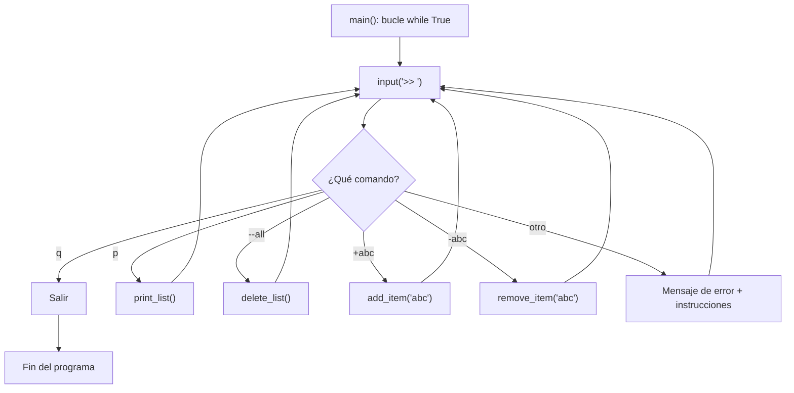

# Laboratorio 5.3 – Creador de listas de artículos

## Objetivo de la práctica:
Al finalizar la práctica, serás capaz de:
- Reafirmar el uso de archivos con Python.
- Crear un módulo que permita mantener una lista de artículos guardada en un archivo, con opciones para agregar, quitar, borrar y mostrar elementos.

## Objetivo Visual


## Duración aproximada:
- 20 minutos.

## Tabla de ayuda:
| Herramienta | Versión / Detalle | Notas |
| --- | --- | --- |
| Python | 3.10 o superior | |
| Visual Studio Code | Última versión estable | |
| Carpeta de trabajo | `ws_curso` | El archivo `list.txt` se crea directamente ahí (el enunciado no especifica una subcarpeta, a diferencia de las prácticas 5.1 y 5.2) |
| Archivo a crear | `p5_3.py` | |
| Comandos del programa | `P`, `+artículo`, `-artículo`, `--all`, `Q` | Ver `show_instructions()` |

## Instrucciones

### Tarea 1. Preparar el archivo base y corregir un detalle de sintaxis
Paso 1. En `ws_curso`, crear el archivo `p5_3.py` y capturar el esqueleto de código proporcionado.

Paso 2. Antes de ejecutar nada, observa con cuidado la función `show_instructions()`: al `print()` de instrucciones le falta el paréntesis de cierre.

```python
def show_instructions():
    """Imprime las instrucciones"""
    print("""Opciones:
    P -- Imprime la lista.
    +abc -- Agrega 'abc' a la lista.
    -abc -- Remove 'abc' de la lista.
    --all -- Borra la lista entera.
    Q -- Salir\n"""
```

> **¿Cuál es el problema?** Cuenta los paréntesis: `print(` abre uno, pero la línea termina con `\n"""` y no hay ningún `)` que lo cierre. Al ejecutar este código tal cual, Python lanzaría un error de sintaxis (`SyntaxError: unexpected EOF while parsing` o similar), ya que interpreta que la llamada a `print()` sigue "abierta" y espera más código.

Paso 3. Corregir la función agregando el paréntesis de cierre faltante.

```python
def show_instructions():
    """Imprime las instrucciones"""
    print("""Opciones:
    P -- Imprime la lista.
    +abc -- Agrega 'abc' a la lista.
    -abc -- Remove 'abc' de la lista.
    --all -- Borra la lista entera.
    Q -- Salir\n""")
```

Paso 4. Capturar el resto del esqueleto tal como se entrega, incluyendo `main()` (que ya está completo y no requiere modificaciones):

```python
def add_item(item):
    """Agrega un item después de quitar los espacios en blanco
    del archivo list.txt"""
    pass  # Ingresa tu código aquí

def remove_item(item):
    """Remueve la primera instancia de item en la list.txt
    Si el producto no existe en la lista, avisa al usuario"""
    pass  # Ingresa tu código aquí.

def delete_list():
    """Borra el contenido del archivo list.txt"""
    pass  # Ingresa tu código aquí.

def print_list():
    """Despliega el contenido de la lista"""
    pass  # Ingresa tu código aquí.

def main():
    show_instructions()

    while True:
        choice = input('>> ')

        if choice.lower() == 'q':
            print('Adios!')
            break
        elif choice.lower() == 'p':
            print_list()
        elif choice.lower() == '--all':
            delete_list()
        elif len(choice) and choice[0] == '+':
            add_item(choice[1:])
        elif len(choice) and choice[0] == '-':
            remove_item(choice[1:])
        else:
            print("No se entiende.")
            show_instructions()


if __name__ == '__main__':
    main()
```

> **¿Qué hace `if __name__ == '__main__':`?** Como viste en el Capítulo 2, este patrón asegura que `main()` solo se ejecute cuando `p8_3.py` se corre directamente, y no si en algún momento decides importar sus funciones (`add_item`, `print_list`, etc.) desde otro archivo.
>
> **¿Cómo distingue `main()` entre `'--all'` y una resta como `'-manzana'`?** El `elif choice.lower() == '--all':` se evalúa **antes** que el `elif ... choice[0] == '-':`. Como Python revisa las condiciones `elif` en orden y se detiene en la primera que sea verdadera, una entrada exacta `'--all'` siempre se atenderá como "borrar toda la lista", y nunca llegará a interpretarse como "remover el artículo '-all'".

### Tarea 2. Implementar `add_item()`
Paso 1. Completar `add_item()` para que elimine espacios en blanco del elemento recibido y lo agregue como una nueva línea al final de `list.txt`.

```python
def add_item(item):
    """Agrega un item después de quitar los espacios en blanco
    del archivo list.txt"""
    item = item.strip()
    with open('list.txt', 'a') as archivo:
        archivo.write(item + '\n')
    print(f"'{item}' fue agregado a la lista.")
```

> **¿Qué hace `item.strip()`?** Elimina los espacios en blanco (y saltos de línea) **al inicio y al final** de la cadena — por ejemplo, convierte `"  manzanas  "` en `"manzanas"`. No afecta espacios que estén en medio del texto.
>
> **¿Por qué se abre el archivo en modo `'a'`?** Porque cada vez que el usuario agrega un artículo, se debe **conservar** todo lo que ya estaba en la lista y simplemente añadir el nuevo al final — el modo `'a'` (agregar) hace exactamente eso, a diferencia de `'w'`, que borraría los artículos ya guardados.

### Tarea 3. Implementar `remove_item()`
Paso 1. Completar `remove_item()`. Como sugiere el enunciado, esto requiere abrir el archivo **dos veces**: una para leer su contenido completo y localizar el artículo, y otra para reescribir el archivo sin él.

```python
def remove_item(item):
    """Remueve la primera instancia de item en la list.txt
    Si el producto no existe en la lista, avisa al usuario"""
    item = item.strip()
    try:
        with open('list.txt', 'r') as archivo:
            lineas = archivo.read().splitlines()
    except FileNotFoundError:
        lineas = []

    if item in lineas:
        lineas.remove(item)
        with open('list.txt', 'w') as archivo:
            for linea in lineas:
                archivo.write(linea + '\n')
        print(f"'{item}' fue eliminado de la lista.")
    else:
        print(f"'{item}' no se encuentra en la lista.")
```

> **¿Qué hace `archivo.read().splitlines()`?** `read()` devuelve el contenido completo del archivo como una sola cadena de texto; `splitlines()` la separa en una lista de líneas, **sin** conservar los caracteres de salto de línea (a diferencia de `readlines()`, que sí los conserva). Esto es justo lo que sugiere el enunciado, y facilita comparar cada línea contra `item` sin preocuparse por un `\n` sobrante.
>
> **¿Qué hace `try/except FileNotFoundError`?** Si el usuario intenta quitar un artículo antes de haber agregado ninguno, `list.txt` todavía no existiría, y `open('list.txt', 'r')` lanzaría un `FileNotFoundError`. Capturarlo y continuar con una lista vacía (`lineas = []`) evita que el programa se detenga abruptamente por ese caso.
>
> **¿Qué hace `lineas.remove(item)`?** Es un método de las listas que elimina la **primera** aparición de `item` en la lista — tal como pide el enunciado ("remueve la primera instancia"). Si `item` apareciera varias veces en el archivo, las demás apariciones permanecerían intactas.
>
> **¿Por qué se vuelve a abrir el archivo, esta vez en modo `'w'`?** Una vez que `item` fue quitado de la lista **en memoria** (`lineas`), es necesario reescribir el archivo completo para que ese cambio quede reflejado en disco. Abrir en modo `'w'` borra el contenido anterior del archivo, y el ciclo `for` vuelve a escribir, línea por línea, únicamente los artículos que **sí** deben permanecer.

### Tarea 4. Implementar `delete_list()` y `print_list()`
Paso 1. Completar `delete_list()`, que debe vaciar por completo el contenido de `list.txt`.

```python
def delete_list():
    """Borra el contenido del archivo list.txt"""
    with open('list.txt', 'w') as archivo:
        pass
    print('La lista fue borrada.')
```

> **¿Por qué basta con abrir el archivo en modo `'w'` sin escribir nada?** Como viste en la práctica 5.2, el solo hecho de **abrir** un archivo en modo `'w'` trunca su contenido existente. No es necesario escribir nada explícitamente para "vaciarlo" — abrirlo y cerrarlo (aunque sea sin escribir) ya deja el archivo vacío.

Paso 2. Completar `print_list()`, que debe mostrar el contenido actual de `list.txt`.

```python
def print_list():
    """Despliega el contenido de la lista"""
    try:
        with open('list.txt', 'r') as archivo:
            contenido = archivo.read()
        if contenido:
            print(contenido)
        else:
            print('La lista está vacía.')
    except FileNotFoundError:
        print('La lista está vacía.')
```

> **¿Por qué se contempla tanto un archivo vacío como uno inexistente?** Un archivo puede estar vacío después de usar `--all` (existe, pero `contenido` sería una cadena vacía `""`, que Python evalúa como falso en el `if`), o puede no existir todavía si el usuario ejecuta `p` antes de agregar cualquier artículo (lo que dispara `FileNotFoundError`). Ambos casos deben mostrar el mismo mensaje amigable, en lugar de un error o una pantalla en blanco sin explicación.

### Tarea 5. Probar el programa completo
Paso 1. Ejecutar `p8_3.py` y probar cada comando: agregar varios artículos, listarlos, quitar uno, intentar quitar uno que no existe, y borrar la lista completa.

```bash
python p5_3.py
```

### Resultado esperado
Una sesión de ejemplo, probando las cinco funciones:

```
Opciones:
    P -- Imprime la lista.
    +abc -- Agrega 'abc' a la lista.
    -abc -- Remove 'abc' de la lista.
    --all -- Borra la lista entera.
    Q -- Salir

>> +manzanas
'manzanas' fue agregado a la lista.
>> +peras
'peras' fue agregado a la lista.
>> +uvas
'uvas' fue agregado a la lista.
>> p
manzanas
peras
uvas

>> -peras
'peras' fue eliminado de la lista.
>> p
manzanas
uvas

>> -kiwi
'kiwi' no se encuentra en la lista.
>> --all
La lista fue borrada.
>> p
La lista está vacía.
>> q
Adios!
```
