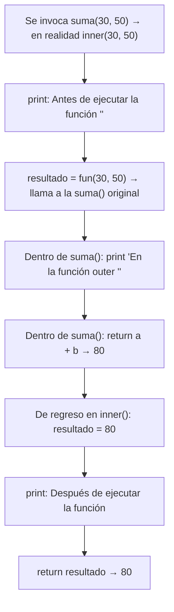

# Laboratorio 6.1 – Decoradores

## Objetivo de la práctica:
Al finalizar la práctica, serás capaz de:
- Usar funciones anidadas para definir decoradores en Python.
- Comprender cómo un decorador "envuelve" una función para agregarle comportamiento adicional, sin modificar su código original.
- Usar `*args` y `**kwargs` para que un decorador funcione con funciones de cualquier firma.

## Objetivo Visual


## Duración aproximada:
- 15 minutos.

## Tabla de ayuda:
| Herramienta | Versión / Detalle | Notas |
| --- | --- | --- |
| Python | 3.10 o superior | |
| Visual Studio Code | Última versión estable | |
| Carpeta de trabajo | `ws_curso` | |
| Archivo a crear | `p6_1.py` | |

## Instrucciones

### Tarea 1. Capturar el esqueleto de código
Paso 1. En `ws_curso`, crear un archivo de nombre `p6_1.py` y capturar el código inicial proporcionado.

```python
# Uso de decoradores
def decorador(fun):
    def inner(*args, **kwargs):
        pass  # Aquí podría ir tu código
    return inner

# Agrega el decorador a la función
def suma(a, b):
    pass  # Aquí podría ir tu código

a, b = 30, 50

# Invocación a la funcionalidad normal
print("{} + {} = {}".format(a, b, suma(a, b)))
```

> **¿Qué es un decorador?** Es una función que recibe **otra función** como argumento (`fun`), define una nueva función interna (`inner`) que agrega comportamiento adicional, y devuelve esa función interna. Cuando aplicas un decorador a otra función, en realidad estás **reemplazando** esa función original por la versión "envuelta" (`inner`).
>
> **¿Qué hacen `*args` y `**kwargs` en la firma de `inner()`?** Permiten que `inner()` acepte **cualquier** combinación de argumentos posicionales (`*args`) y por palabra clave (`**kwargs`), sin importar cuántos ni de qué tipo. Esto es lo que hace posible que un mismo decorador funcione con funciones de firmas distintas — en este caso, con `suma(a, b)`, pero también funcionaría con una función que reciba tres argumentos, o ninguno.

### Tarea 2. Completar la función `inner()`
Paso 1. Antes de invocar a la función que se está decorando, imprimir un mensaje.

```python
def decorador(fun):
    def inner(*args, **kwargs):
        print("Antes de ejecutar la función ''")
    return inner
```

Paso 2. Invocar a la función original (`fun`), pasándole los mismos argumentos que recibió `inner()`, y almacenar su resultado.

```python
def decorador(fun):
    def inner(*args, **kwargs):
        print("Antes de ejecutar la función ''")
        resultado = fun(*args, **kwargs)
    return inner
```

> **¿Qué hace `fun(*args, **kwargs)`?** Aquí el `*` y `**` cumplen la función **opuesta** a cuando aparecen en la definición de `inner()`: en lugar de *empaquetar* argumentos, **desempaquetan** el contenido de `args` y `kwargs` para pasarlos como argumentos individuales a `fun`. Es decir, si `inner(30, 50)` fue invocada, entonces `args = (30, 50)`, y `fun(*args, **kwargs)` termina siendo equivalente a `fun(30, 50)`.
>
> **¿Por qué es importante usar `fun`, y no llamar directamente a `suma`?** Porque `fun` es el parámetro que recibió el decorador — la función **original**, antes de ser envuelta. Si `inner()` intentara llamar a `suma(...)` directamente, estaría llamándose **a sí misma** (ya que, después de decorar, el nombre `suma` apunta a `inner`), provocando una recursión infinita.

Paso 3. Imprimir un mensaje después de invocar a la función, y hacer que `inner()` devuelva el resultado almacenado.

```python
def decorador(fun):
    def inner(*args, **kwargs):
        print("Antes de ejecutar la función ''")
        resultado = fun(*args, **kwargs)
        print("Después de ejecutar la función")
        return resultado
    return inner
```

> **¿Por qué `inner()` debe devolver `resultado`, en lugar de dejar que `decorador()` lo haga?** `decorador()` ya terminó de ejecutarse mucho antes —su trabajo fue simplemente **construir y devolver** la función `inner`—; es `inner()` quien se ejecuta cada vez que alguien invoca `suma(a, b)`, así que es `inner()` quien debe encargarse de devolver el valor final a quien la llamó.

### Tarea 3. Aplicar el decorador y completar `suma()`
Paso 1. Anteponer `@decorador` a la definición de `suma()`, y completar su cuerpo con un mensaje y el cálculo de la suma.

```python
@decorador
def suma(a, b):
    print("En la función outer ''")
    return a + b
```

> **¿Qué hace `@decorador` justo antes de `def suma(...)`?** Es azúcar sintáctica equivalente a escribir `suma = decorador(suma)` inmediatamente después de definir la función. En otras palabras, el nombre `suma` deja de apuntar a la función original y pasa a apuntar a `inner` — la versión decorada —, aunque el código de la función original (ahora accesible internamente como `fun` dentro del decorador) sigue existiendo y sigue siendo la que realiza el cálculo real.
>
> **¿Por qué a la función original se le suele llamar la función "outer"?** Es una forma de distinguirla de `inner` (la función interna del decorador): `suma()` es la función "de más afuera" desde la perspectiva de quien la usa —es la que uno esperaría llamar directamente—, aunque en la práctica, gracias al decorador, la llamada real pasa primero por `inner()`.

### Tarea 4. Ejecutar el programa
Paso 1. Guardar y ejecutar `p6_1.py` desde la terminal.

```bash
python p6_1.py
```

> **Resultado esperado:**
> ```
> Antes de ejecutar la función ''
> En la función outer ''
> Después de ejecutar la función
> 30 + 50 = 80
> ```
> **Explicación del orden de las líneas:** aunque el código llama a `suma(a, b)` una sola vez, en realidad se ejecutan **tres bloques de código distintos** en cadena: primero el mensaje de "antes" dentro de `inner()`, luego el mensaje de "outer" y el cálculo dentro de la función `suma()` original, y finalmente el mensaje de "después" dentro de `inner()` — todo esto ocurre **antes** de que `print("{} + {} = {}"...)` reciba el valor de retorno `80` y lo muestre en la última línea.

### Tarea 5. Profundizar: nombrar la función decorada dinámicamente (opcional)
Paso 1. Como ejercicio adicional, modifica los mensajes para que incluyan el nombre real de la función decorada, usando `fun.__name__`.

```python
def decorador(fun):
    def inner(*args, **kwargs):
        print(f"Antes de ejecutar la función '{fun.__name__}'")
        resultado = fun(*args, **kwargs)
        print("Después de ejecutar la función")
        return resultado
    return inner
```

> 💡 **Buena práctica:** en decoradores reales usados en proyectos, es común además agregar `from functools import wraps` y el decorador `@wraps(fun)` justo antes de definir `inner()`. Esto hace que `inner.__name__`, `inner.__doc__` y otros metadatos de la función decorada reflejen los de la función **original** (`suma`) en lugar de los de `inner` — algo que herramientas de depuración, documentación automática y otros decoradores adicionales suelen esperar. No es necesario para esta práctica, pero vale la pena conocerlo antes de escribir decoradores en código de producción.

### Resultado esperado
```
Antes de ejecutar la función ''
En la función outer ''
Después de ejecutar la función
30 + 50 = 80
```
