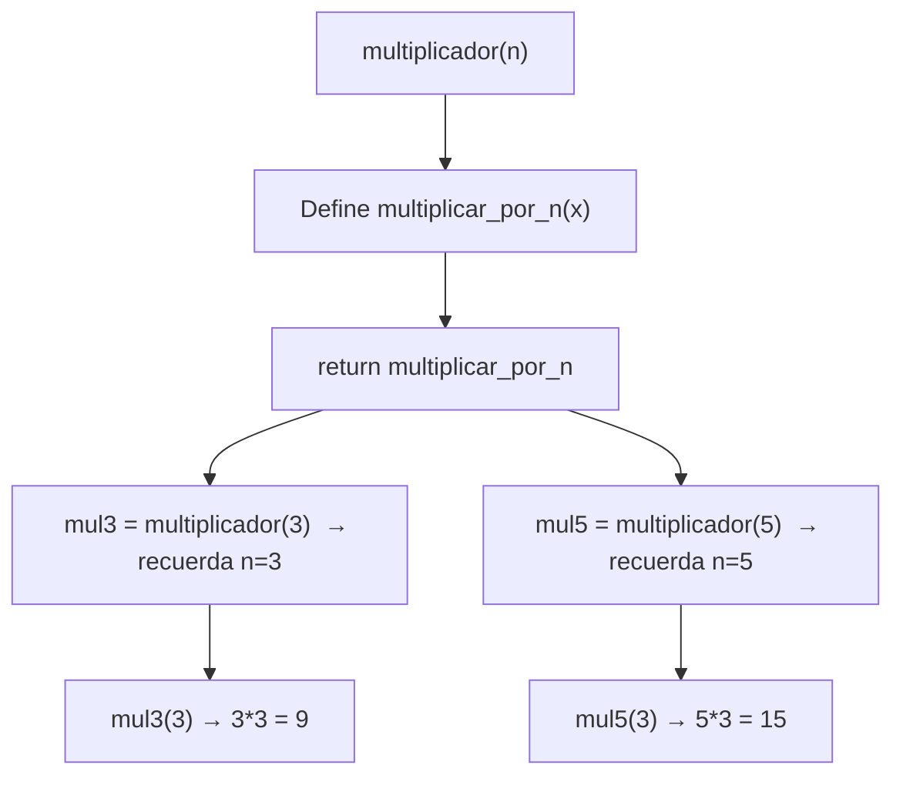

# Laboratorio 6.2 – Closures

## Objetivo de la práctica:
Al finalizar la práctica, serás capaz de:
- Reafirmar el uso de funciones anidadas para crear *closures* (cierres).
- Construir una "fábrica de funciones": una función que genera y devuelve otras funciones personalizadas.
- Identificar y evitar un error clásico al crear closures dentro de un ciclo.

## Objetivo Visual


## Duración aproximada:
- 15 minutos.

## Tabla de ayuda:
| Herramienta | Versión / Detalle | Notas |
| --- | --- | --- |
| Python | 3.10 o superior | |
| Visual Studio Code | Última versión estable | |
| Carpeta de trabajo | `ws_curso` | |
| Archivo a crear | `p6_2.py` | |

## Instrucciones

### Tarea 1. Crear la función que genera closures
Paso 1. En `ws_curso`, crear un archivo de nombre `p6_2.py`.

Paso 2. Definir una función `multiplicador(n)` que, en lugar de multiplicar directamente, **devuelva otra función** capaz de multiplicar cualquier número por `n`.

```python
def multiplicador(n):
    """Devuelve una función que multiplica su argumento por n."""
    def multiplicar_por_n(x):
        return x * n
    return multiplicar_por_n
```

> **¿Qué es un *closure* (cierre)?** Es una función anidada (`multiplicar_por_n`) que **"recuerda"** el valor de una variable de su función contenedora (`n`, definida en `multiplicador`), incluso después de que esa función contenedora ya terminó de ejecutarse. Normalmente, cuando una función termina, sus variables locales desaparecen — pero si una función interna las sigue usando, Python las conserva "atrapadas" (de ahí el nombre *closure*, "cierre") junto con esa función interna.
>
> **¿Por qué se le llama "fábrica de funciones" a `multiplicador()`?** Porque cada vez que la invocas con un valor distinto de `n`, no realiza ningún cálculo por sí misma: en su lugar, **construye y entrega** una función nueva, personalizada para ese valor específico de `n`. `multiplicador(3)` y `multiplicador(5)` no calculan nada — devuelven dos funciones **distintas**, cada una con su propio `n` "recordado".

### Tarea 2. Probar el closure con dos multiplicadores
Paso 1. Desde el REPL de Python, crear dos funciones multiplicadoras: una para multiplicar por 3, y otra para multiplicar por 5.

```python
>>> from p6_2 import multiplicador
>>> mul3 = multiplicador(3)
>>> mul5 = multiplicador(5)
```

> **¿Qué contiene `mul3` en este punto?** Es la función `multiplicar_por_n` devuelta por `multiplicador(3)`, con `n = 3` "atrapado" en su closure. `mul5`, de forma independiente, tiene su propio closure con `n = 5`. Ambas funciones comparten el mismo código (`return x * n`), pero cada una opera sobre un valor distinto de `n`, sin interferir entre sí.

Paso 2. Invocar ambas funciones para confirmar que cada una multiplica por el valor correcto.

```python
>>> print(mul3(3), mul5(3))
```

> **Resultado esperado:**
> ```
> 9 15
> ```
> **Verificación:** `mul3(3)` calcula `3 * 3 = 9` (multiplica por el `3` que `mul3` recuerda), y `mul5(3)` calcula `5 * 3 = 15` (multiplica por el `5` que `mul5` recuerda) — ambas reciben el mismo argumento (`3`), pero producen resultados distintos gracias a lo que cada closure tiene almacenado internamente.

### Tarea 3. Generar varios multiplicadores con un ciclo
Paso 1. En lugar de crear cada multiplicador a mano, usar un ciclo `for` para generar varias funciones multiplicadoras de una sola vez, y guardarlas en una lista.

```python
multiplicadores = []
for n in range(1, 6):
    multiplicadores.append(multiplicador(n))

for fn in multiplicadores:
    print(fn(10))
```

> **¿Por qué este ciclo funciona correctamente?** En cada vuelta del ciclo, `multiplicador(n)` se **invoca** con el valor actual de `n`, y esa invocación crea un `multiplicar_por_n` completamente nuevo, con su propio closure que atrapa el valor de `n` **en ese momento específico** (porque `n` es un parámetro nuevo de cada llamada a `multiplicador`, no la variable del ciclo directamente). Por eso cada función en la lista `multiplicadores` recuerda correctamente su propio valor: `1`, `2`, `3`, `4` y `5`.
>
> **Resultado esperado:**
> ```
> 10
> 20
> 30
> 40
> 50
> ```

### Tarea 4. Identificar el error clásico de closures dentro de un ciclo
Paso 1. Como comparación, observa la siguiente variante **incorrecta**, donde la función se define directamente dentro del ciclo (con una `lambda`), en lugar de pasar por una función "fábrica" como `multiplicador()`.

```python
funciones_incorrectas = []
for n in range(1, 6):
    funciones_incorrectas.append(lambda x: x * n)

for fn in funciones_incorrectas:
    print(fn(10))
```

> **Resultado que produce (incorrecto):**
> ```
> 50
> 50
> 50
> 50
> 50
> ```
> **¿Por qué todas las funciones "recuerdan" el mismo valor?** A diferencia del closure de la Tarea 3, aquí las cinco funciones `lambda` **no tienen cada una su propia copia** de `n` — todas comparten la **misma** variable `n` del ciclo `for` externo. Un closure no atrapa el *valor* que tenía una variable en el momento de crear la función, sino una **referencia** a esa variable. Como las cinco lambdas se crean dentro del mismo ciclo y todas hacen referencia a la misma `n`, cuando finalmente se invocan (después de que el ciclo ya terminó, con `n` fijo en su último valor, `5`), todas ven el mismo valor final: `5`.
>
> 💡 **Buena práctica:** esta es la razón por la que la función `multiplicador()` de la Tarea 1 es el patrón correcto para generar múltiples closures en un ciclo — al pasar `n` como **parámetro** de una función distinta (`multiplicador`), cada llamada crea su propio espacio de variables local, independiente del ciclo externo. Si de verdad necesitas usar una `lambda` dentro de un ciclo, otra forma común de evitar este problema es capturar el valor con un argumento por defecto: `lambda x, n=n: x * n`, donde `n=n` fuerza a Python a copiar el valor de `n` en el momento de crear cada lambda, en lugar de referenciar la variable del ciclo.

### Resultado esperado
Con `mul3 = multiplicador(3)` y `mul5 = multiplicador(5)`:

```
>>> from p9_2 import multiplicador
>>> mul3 = multiplicador(3)
>>> mul5 = multiplicador(5)
>>>
>>> print(mul3(3), mul5(3))
9 15
```
